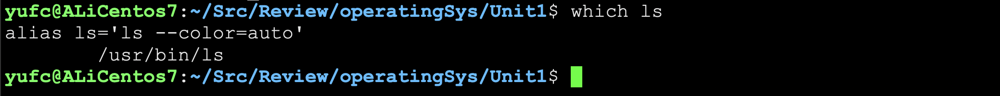
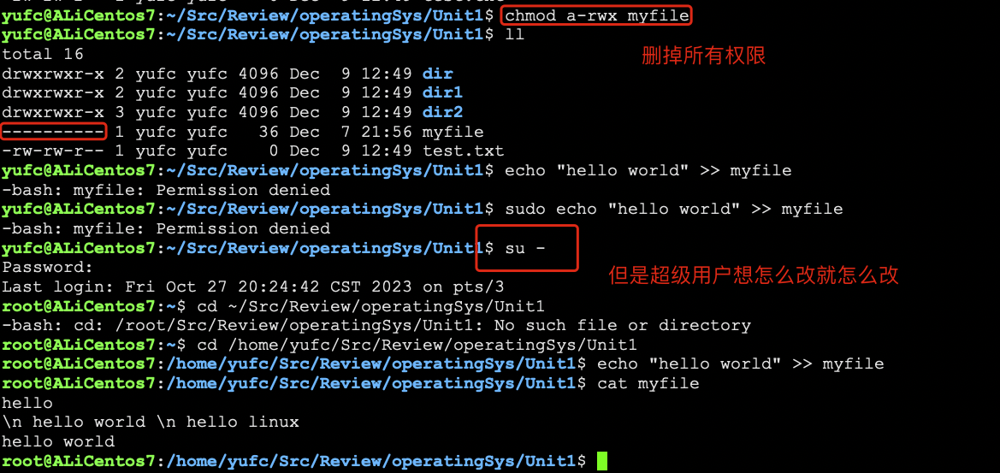
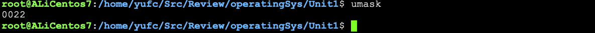
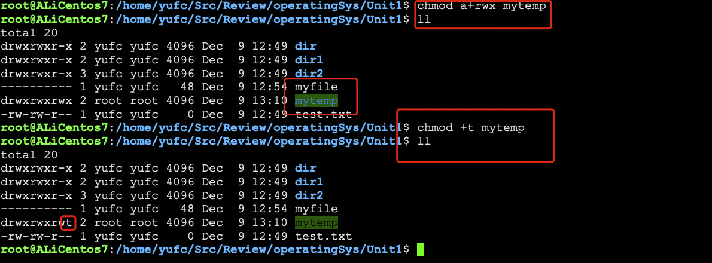

# Linux 基础知识预备

## 1. 基本指令

**touch**

除了创建文件之外，还可以用来更新文件的最新修改时间


**mkdir**

带上`-p`选项可以创建一串目录

**rmdir**

默认只能删空目录

**man**

手册

**cat**

- -b 对非空行输出编号
- -n 对输出的所有行编号
- -s 不输出多行空行

**tac**

反着打印

**more**

类似cat

- -n 对输出的所有行编号
- q 推出 more

如果cat之后看文件刷屏了，看不到最上面的内容，用more指令逐部分查看


**less**

less和more类似，但是使用less可以随意浏览文件，more只能向前移动，不能向后移动，而且less在查看之前不回加载整个文件。

## 2. 重定向

### 2.1 输出的重定向

1. 输出重定向 ( > )
2. 追加重定向 ( >> )

### 2.2 输入重定向


其实 `cat file.txt`完整的写法是`cat < file.txt`

把`file.txt`的东西放到`bak.txt`里面去

```bash
cat file.txt > bak.txt
```

## 2. 基本指令2

**head**

如果只想查看文件前若干行

```bash
head file.txt # 默认查看前十行
head -3 file.txt # 查看前三行
tail -3 file.txt # 查看后三行
```

如果我现在想获取中间任何一段或者一行内容呢？

先重定向前面的内容，然后再tail就行。

```bash
head -1010 file.txt > middle.txt # 然后再用tail
```

但是这种方法要创建临时文件，不好！

```bash
head -1010 file.txt | tail -11 # 用管道就行了
```

**date**

查看时间，具体找man，这个很少用。

**cal**

看日历，具体找man，这个很少用。

**find**

这个选项很常用！

```bash
find ~ -name test.c # 查找~路径下的test.c
```


**which**

在系统路径中，去查找特定的指令所在的路径。



**alias**

给别的命令起别名

```bash
alias zhangsan='ls -al' # 只有在当次登陆有效
```

**grep**

注意：grep是大小写敏感的！

- -i 忽略大小写，变成大小写不敏感
- -n 输出行号
- -v 反向选择，就是显示，没有"搜寻字符串"的内容


**reboot**

重启

**uname -r**

查看计算机体系结构

## 3. 权限（重要）

### 3.1 普通用户和超级用户

### 3.2 文件权限


Linux系统不以文件后缀来区分文件类型。

`a.out`换成什么后缀都能跑。

但是`gcc test.txt`不行的，gcc是个软件，不是linux的东西，他是分后缀的

> 1. d 目录
> 2. '-' 普通文件
> 3. p 管道文件
> 4. b 块文件
> 5. c 字符设备

拥有者，所属组，other的概念，很熟，不用复习了

rwx权限，很熟，不用复习了

**改文件权限**

很熟。



当然这个chmod后面跟数字的，也可以，也很熟了，不用复习。

假设现在一个文件的拥有者是yufc，现在想强制把这个东西丢给yufc2，也是会被限制权限的，不能随便给别人东西（root肯定是不受限制的）。

### 3.3 sudo

能使用sudo说明你是root的信任列表里面的。

而添加信任列表，是需要root身份的。

### 3.4 目录的权限（本质也是文件）

不用复习。很熟悉了。

进入一个目录：执行权限

如果没有r权限，执行`ll`会被拒绝，如果没有w权限，执行`touch`会被拒绝。

### 3.5 新文件默认权限

目录：755

普通文件：664


### 3.6 umask（重要）

**这个需要重点复习。**

其实创建一个目录的起始权限是777，创建一个普通文件的起始权限是666。

那为什么我们看到的是755和664？

**是因为存在权限掩码umask**



只用关注后三位。

```bash
最终权限 = 起始权&~umask
```

我们可以设置umask

比如设置一个极端的umask

```bash
umask 0777 # 这样就能让新文件的权限全部为0
```

### 3.7 删除一个文件所需要的权限

**需要复习。**

**一个文件能否被删除不是由文件自己的属性决定的，而是由文件所属目录是否有x权限所决定的。**

### 3.8 粘滞位（重要）

**需要复习。**

抛出一个问题场景，这个场景十分重要

> 当多个用户共享一个目录，需要在该目录下，进行读写，创建删除文件
>
> 但是自己只能删除自己的，而不能删除别人的（w权限：可以互删，不满足条件）
>
> 只能通过一个新的权限属性（粘滞位）来完成。



t就是表示粘滞位权限，可以看做x权限的一种特殊情况

注意：

- 粘滞位只能给目录设置
- 粘滞位一般是谁加的就只能谁去掉，除非你是root

## 4. vim

很熟悉。稍微复习一下即可。

复习一些常用的指令即可。

首先vim一般会用到两种模式，一种是命令模式，一种是编辑模式。

常见操作：

- `yy`：将当前光标所在的行，复制
- `p`： 粘贴（nyy和np就是复制n行，粘贴n行的意思）
- `u`：撤销历史操作
- `ctrl+r` ：撤销u操作
- `dd`：将当前光标所在的行进行剪切（删除），ndd同理，配合p使用就是剪切
- `shift+~`：大小写切换
- `shift+r`：进入替换模式
- `x/shift+x`：删除光标所在自负，包括之前或者之后的，支持nx

光标定位：

- `shift+g`：光标定位到文件的结尾
- `gg`：光标定位到文件的最开始
- `n+shift+g`：将光标定位到文件的任意行
- `shift+6`：将光标定位到当前行的最开始
- `shift+4`：将光标定位到当前行的结尾

**底行模式**

- `set nu`：调出行号
- `set nonu`：删除行号
- `vs test.c`：实现分屏操作

## 5. gcc/g++

ESc编译的过程，很熟悉了，不再复习。

## 6. GDB

虽然忘记了，但不复习了，比较少用。
