# 信号

## 1. 什么是Linux信号

本质是一种通知机制，用户或OS通过发送一定的信号，通知进程，某些事件已经发生，你可以再后续进行处理！
结合进程，信号的一些结论：

1. 进程要处理信号，必须具备信号“识别”信号的能力(看到+处理)
2. 凭什么进程能够“识别”信号呢?谁“教育”进程的呢?OS，本质就是写OS处理进程部分的程序员
3. 信号产生是随机的，信号还没来的时候，进程可能正在忙自己的事情，所以信号的后续处理，可能不是立即处理的
4. 信号会临时的记录下对应的信号，方便后续进行处理
5. 在什么时候处理呢？合适的时候
6. 一般而言，信号的产生相对于进程而言是异步的！

## 2. 信号如何产生？


**信号处理的常见方式**

1. 默认(进程自带的，程序员写好的逻辑) 
2. 忽略(也是信号处理的一种方式)
3. 自定义动作(捕捉信号)

```bash
man 7 signal # 可以查看信号的描述
```

**信号发送的本质**

信号位图是在task_struct里面保存的，谁能改pcb，只有OS有这个资格！因为pcb 是内核数据结构。

本质：OS向目标进程写**信号**！OS直接修改pcb中指定位图结构，完成“发送”信号的过程！

## 3. signal系统调用

### 3.1 一个例子


这里有个回调函数，通过回调的方式，修改对应的信号捕捉的方法。

**signal函数调用细节：**

- 仅仅只是修改进程对特定信号的后续处理动作，不是直接调用对应的处理动作！

- 意思就是，调用完signal catchSig并没有被调用 只有等到信号来了，才会被调用！

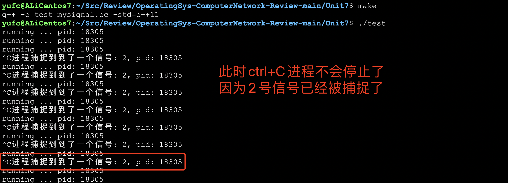

```cc
#include <iostream>
#include <signal.h>
#include <unistd.h>

void catchSig(int sig)
{
    // 此时的sig就是捕捉到的信号的编号
    std::cout << "进程捕捉到到了一个信号: " << sig << ", pid: " << getpid() << std::endl;
}

int main()
{
    signal(SIGINT, catchSig);
    while (true)
    {
        std::cout << "running ... pid: " << getpid() << std::endl;
        sleep(1);
    }
    return 0;
}
```

### 3.2 核心转储


细节比较复杂，这里不详细说了，具体可以看回整理好的笔记。

### 3.3 模拟实现一个kill系统调用

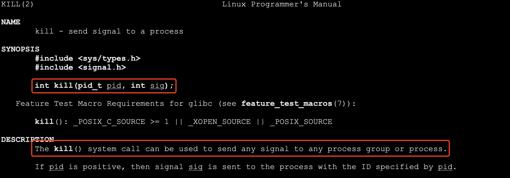

用这个系统调用就可以了。

```cc
static void Usage(std::string proc)
{
    std::cout << "Usage:\r\n\t" << proc << "signumber processid" << std::endl;
}
int main(int argc, char **argv)
{
    if (argc != 3)
    {
        Usage(argv[0]);
        exit(1);
    }
    int signumber = atoi(argv[1]);
    int procid = atoi(argv[2]);
    kill(procid, signumber);
    return 0;
}
```


**`abort()`也可以用来终止一个进程**

### 3.4 学习管道的时候所涉及到的信号

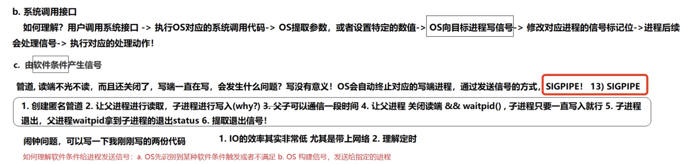

## 4. alarm和SIGALAM信号

调用alarm函数可以设定一个闹钟,也就是告诉内核在seconds秒之后给当前进程发SIGALRM信号，该信号的默认处理动作是终止当前进程。

这个函数的返回值是0或者是以前设定的闹钟时间还余下的秒数。打个比方,某人要小睡一觉,设定闹钟为30分钟之后响,20分钟后被人吵醒了,还想多睡一会儿,于是重新设定闹钟为15分钟之后响,"以前设定的闹钟时间还余下的时间”就是10分钟。如果seconds值为0,表示取消以前设定的闹钟,函数的返回值仍然是以前设定的闹钟时间还余下的秒数。

```cc
int main()
{
    // 这里就可以计算count能计算多少次了（可以吗？）
    alarm(1);
    int count = 0;
    while (true)
    {
        std::cout << "count: " << count++ << std::endl;
    }
    return 0;
}
```

## 5. 硬件异常导致的信号产生


## 6. 信号其他相关概念

**重要概念**

- 实际执行信号的处理动作成为信号递达（Delivery）
- 信号从产生到递达之间的状态，成为信号未决（Pending）
- 进程可以选择阻塞某个信号
- 被阻塞的信号产生时将保持在未决状态，直到进程解除对此信号的阻塞，才执行递达动作
- 注意，阻塞和忽略是不同的，只要信号被阻塞就不会递达，而忽略是递达之后的一种处理动作

**信号抵达的自定义处理方法：**

其实调用`signal`函数其实就是把pending表填上我们传过去的信号编号，然后handler表填上处理方法。

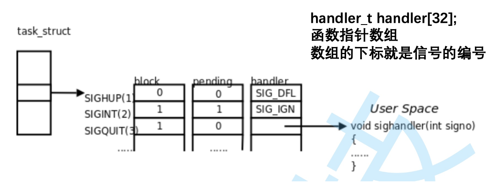

```cpp
int main()
{
    // 处理信号
    signal(2, SIG_IGN);
    signal(2, SIG_DFL);
    return 0;;
}
```

```cpp
/* Fake signal functions.  */
#define SIG_ERR	((__sighandler_t) -1)		/* Error return.  */
#define SIG_DFL	((__sighandler_t) 0)		/* Default action.  */
#define SIG_IGN	((__sighandler_t) 1)		/* Ignore signal.  */
```

这里就是对应的处理方法。

**所以，再重复一次：调用signal不是调用handler方法 而是把东西填到pcb里面的这些表中而已。**

- 发送信号：填pending

- 处理信号：首先在pending里面找，找到了，说明有这个信号，但是此时，不是直接调用对应的 handler，而是先检查一下，是否有被block。

## 7. sigset_t

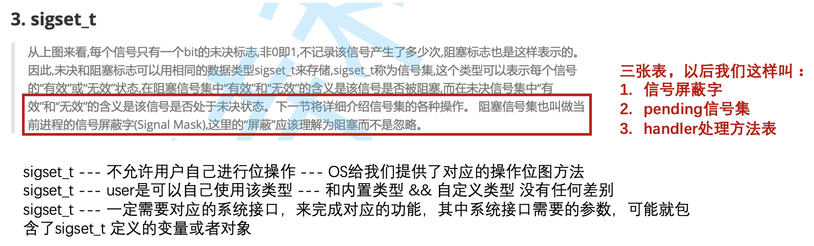

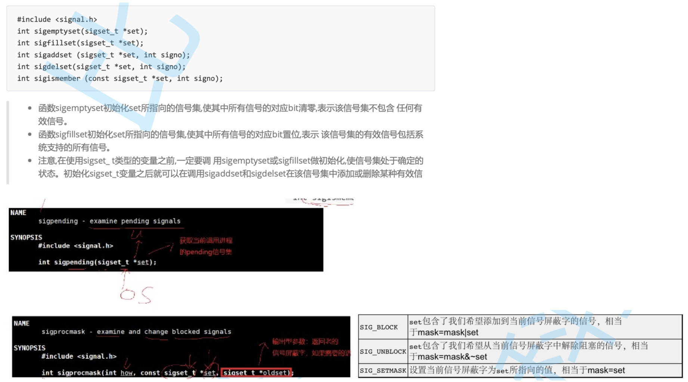

### 7.1 提出三个问题

1. 如果我们对所有的信号都进行了自定义捕捉 --- 我们是不是就写了一个不会被异常或者 用户杀掉的进程??可以吗??
2. 如果我们将2号信号block，并且不断的获取当前并打印当前进程的pending信号集，如果 我们发送一个2号信号，我们就应该肉眼看到pending信号集中，有一个比特位0->1
3. 如果我们对所有的信号都进行block，那是不是和1一样？

### 7.2 回答问题1

```cpp
void catchSig(int signum)
{
    std::cout << "捕获到了一个信号: " << signum << std::endl;
}
int main()
{
    for (int i = 0; i <= 31; i++)
    {
        signal(i, catchSig); // 尝试捕捉所有的信号
    }
    while (true)
    {
        std::cout << "pid: " << getpid() << std::endl;
        sleep(1);
    }
    return 0;
}
```

尝试捕捉所有的信号。


发现，9号信号是不能被捕捉的！

**结论：9号信号不能被捕捉！**

### 7.3 回答问题2

写个程序看看是不是这么回事就可以了。


**用这几个函数就可以了。**

```cpp
static void showPending(sigset_t &pending)
{
    for (int sig = 1; sig <= 31; sig++)
    {
        if (sigismember(&pending, sig))
            std::cout << "1"; // 说明在这个集合里面
        else
            std::cout << "0";
    }
    std::cout << "\n";
}

int main()
{
    // 1. 定义信号集对象
    sigset_t bset, obset;
    sigset_t pending;
    // 2. 初始化
    sigemptyset(&bset);
    sigemptyset(&obset);
    sigemptyset(&pending);
    // 3. 添加我们需要屏蔽的信号
    sigaddset(&bset, 2);
    // 4. 设置set到内核对应的进程中 [默认情况: 进程不会block任何信号]
    int n = sigprocmask(SIG_BLOCK, &bset, &obset);
    assert(!n);
    (void)n;
    // 5. 重复循环打印当前进程的pending信号集
    while (true)
    {
        sigpending(&pending); // 获取当前进程的信号集
        showPending(pending); // 打印当前进程的信号集
        sleep(1);
    }
    return 0;
}
```


因为我只设置了2号信号屏蔽，所以呢，如果我发送其他信号，进程是会结束的。


### 7.4 回答第三个问题

**这个的验证很简单，和前面的代码都一样的，稍微修改一下就行，然后我们会发现，9号信号是不能被屏蔽的，19号也不可以。**

## 8. 信号的处理

上面第七节，我们介绍完了信号是如何保存的，下面我们要学一下信号时如何被处理的。

### 8.1 陷入内核的概念

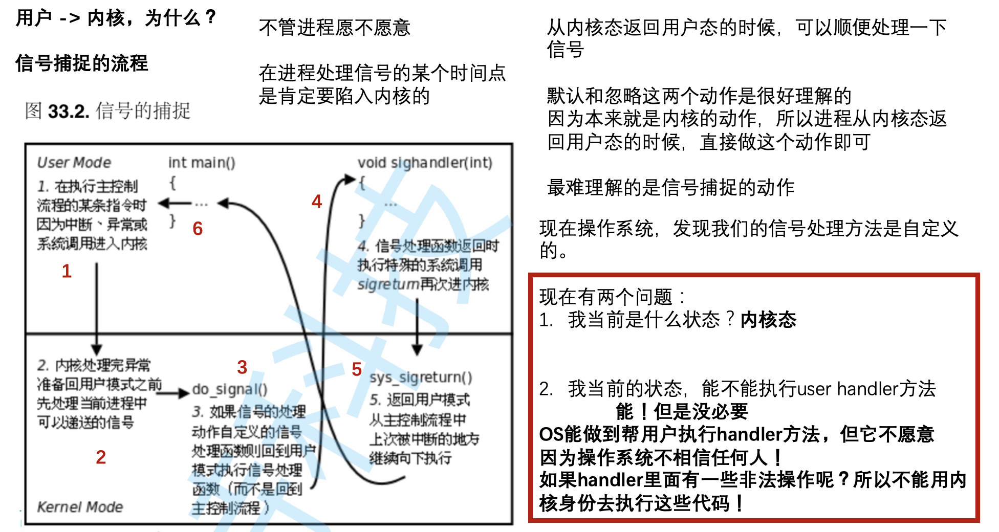

### 8.2 sigaction函数和sigaction结构体

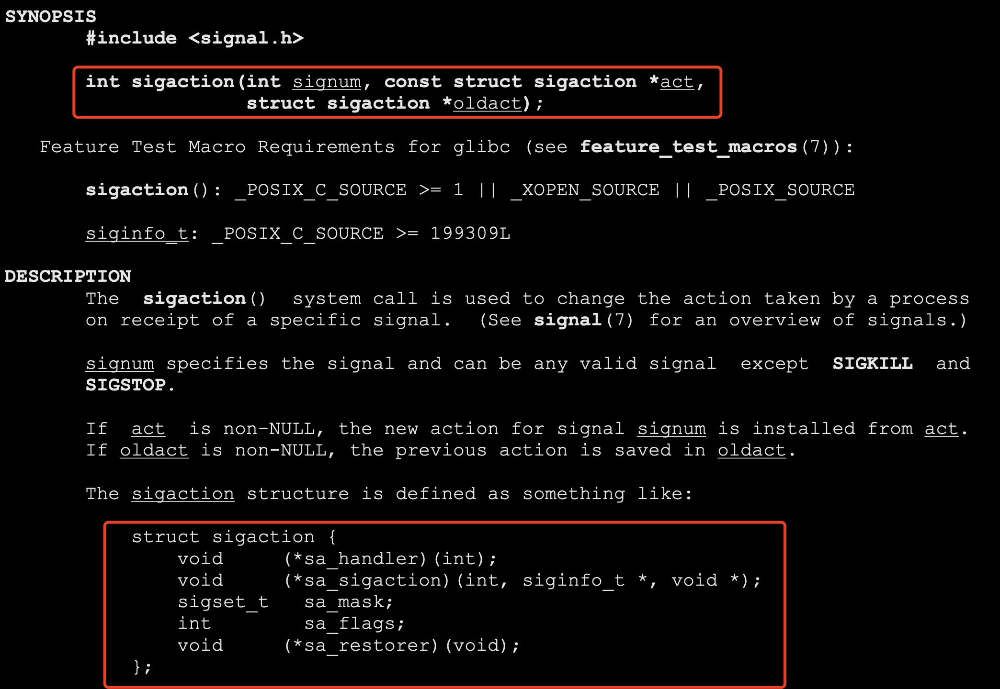

```cpp
void handler(int signum)
{
    std::cout << "捕获了一个信号: " << signum << std::endl;
}
int main()
{
    // 内核数据类型，但是我们下面这些定义是在user栈上定义的
    struct sigaction act, oact;
    act.sa_flags = 0;
    sigemptyset(&act.sa_mask);
    act.sa_handler = handler;
    // 把上面定义的东西丢到进程的pcb里面去
    sigaction(2, &act, &oact);
    std::cout << "default action: " << (int)oact.sa_handler << std::endl;
    while (true)
        sleep(1);
    return 0;
}
```

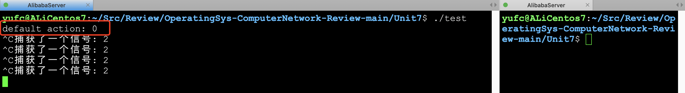

**现在提出一个问题：如果处理信号的时候，执行自定义动作， 如果处理信号期间，又来了同样的信号， OS如何处理?**


通过上面的文字，现在我们来证明这个问题：

- 如果刚才那个代码，我在**处理信号的时候发送2号信号**，OS是不会处理的，因为已经被block了，可以通过代码验证！


## 9. 关于信号的一些补充

信号捕捉，并没有创建新的进程和线程。

### 9.1 重入的概念

**该函数重入了：一个函数在同一时间被多个执行流同时进入。**

假设，比如我在调用链表插入这个insert函数， 调用到一半，进程被陷入内核，然后回来的 时候，需要处理2号信号，刚好2号信号，就 是调用这个insert函数， 此时insert函数被重入!

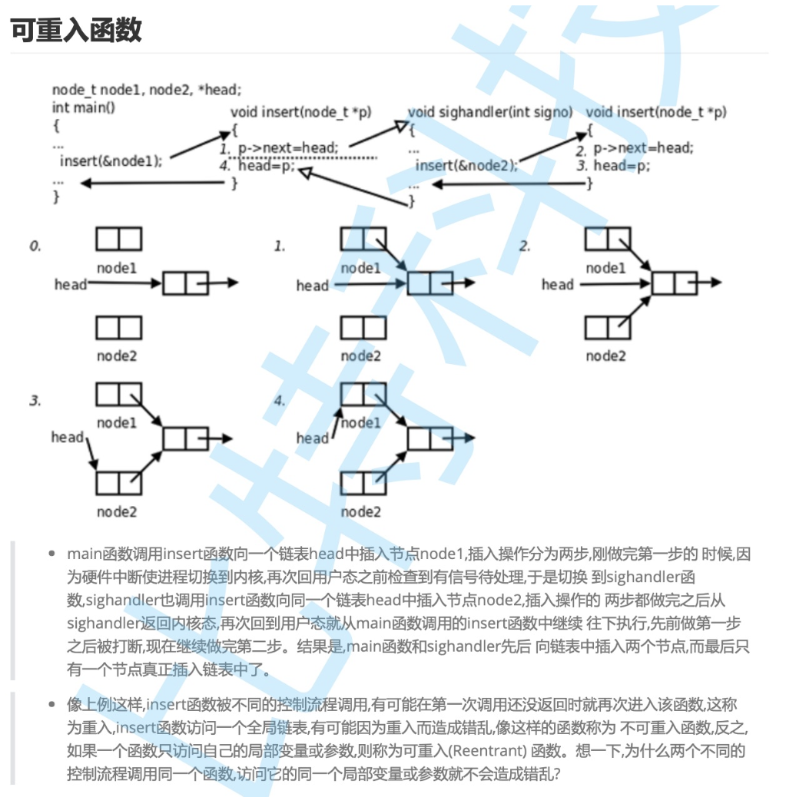

**如果一个函数，被重入不会出现问题，这种函数叫做可重入函数。**

**如果像上面这个insert函数，被重入会出现问题，这样的函数叫做不可重入函数**

### 9.2 volatile关键字

我们写一个代码，看下这个场景。

```cpp
int flag = 0;
void changeFlag(int signum)
{
    (void)signum;
    std::cout << "change flag: " << flag;
    flag = 1;
    std::cout << "->" << flag << std::endl;
}
int main()
{
    signal(2, changeFlag); // 收到二号信号去改一下全局的flag
    while(!flag) // 如果flag还是0
    {
      	sleep(1);
    }
  	std::cout << "进程正常退出后: " << flag << std::endl;
    return 0;
}
```

这个代码很简单，如果发送2号信号，flag就会被改成1，然后循环进不去，进程就会结束。


这是合理的结果。

然后如果我改一下makefile

```makefile
test:mysignal.cc
	g++ -o $@ $^ -std=c++11 -O3
.PHONY:clean
clean:
	rm -f test
```

`-O3`代表最高的优化级别。


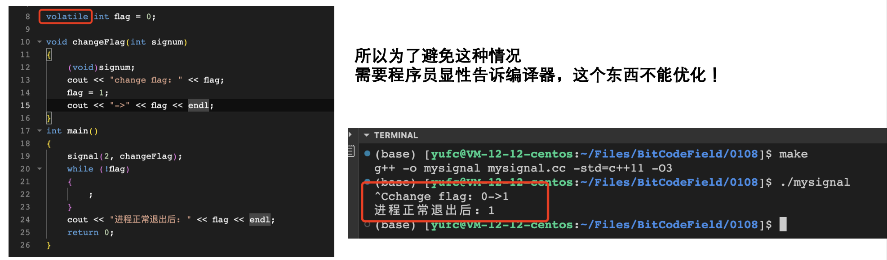

## 10. SIGCHLD信号（选学）


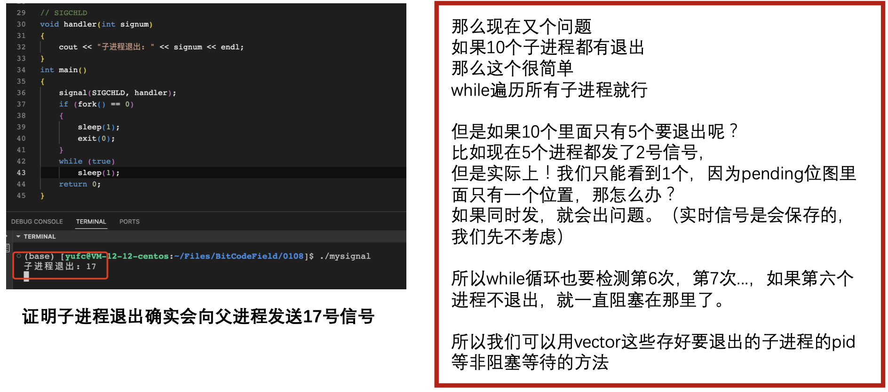


