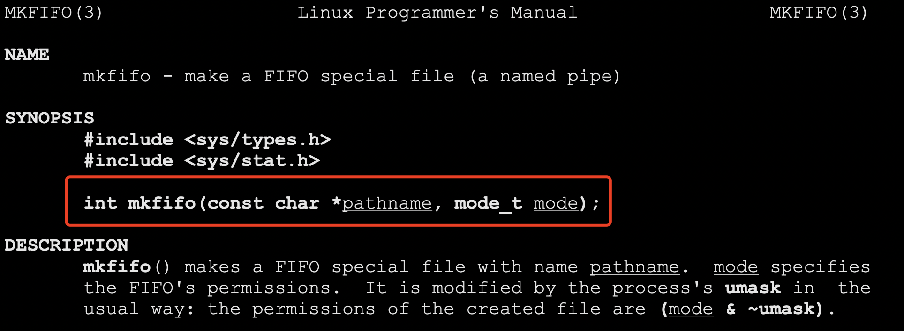
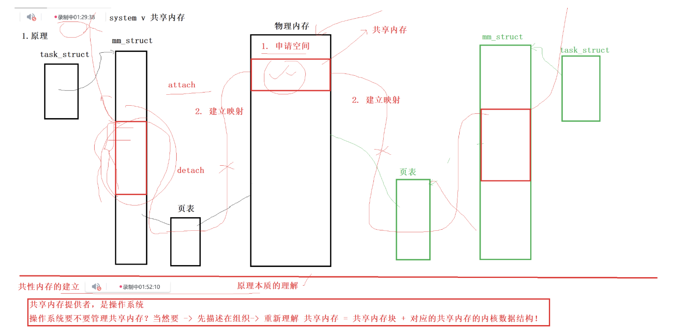
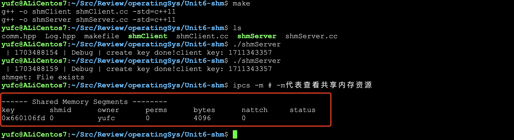
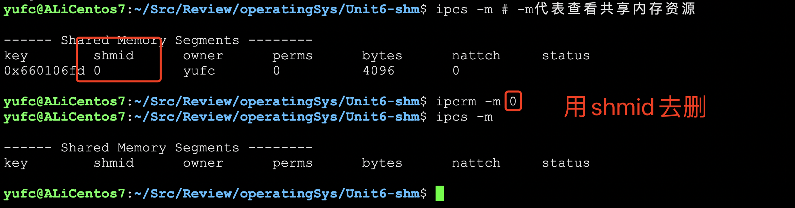
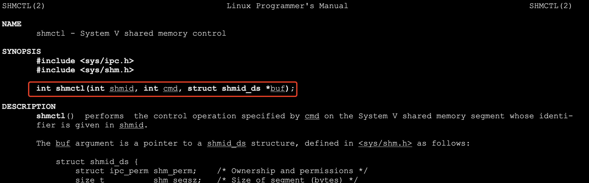
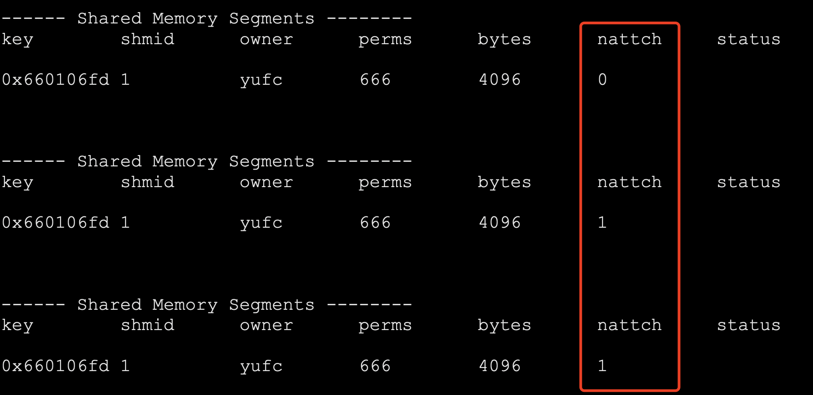
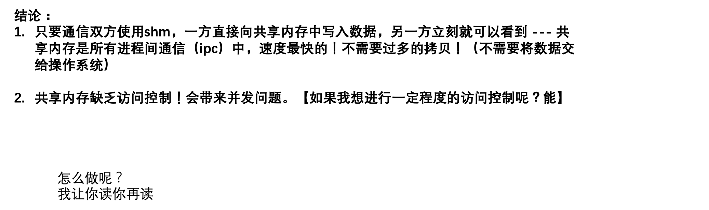
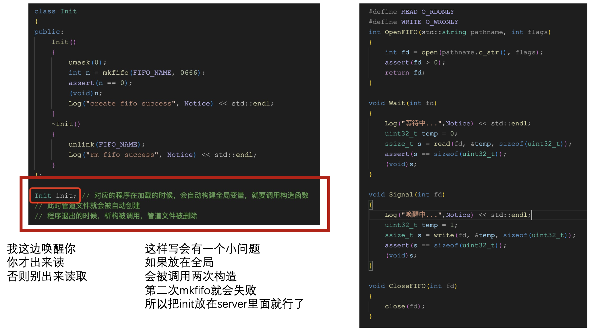

# 复习六.进程间通信

## 1. 什么是进程间通信

进程运行具有独立性，想要进程间通信，难度是比较大的。

进程间通信的本质：交换数据，本质：让不同进程看到同一份资源（内存空间）

## 2. 初识管道


## 3. 进程间通信的一些标准

1. Linux原生能提供的 --- 管道
2. SystemV -- 内存共享、消息队列（不常用）、信号量（不讲，只说原理）
3. Posix --- 多线程 --- 网络通信

## 4. 管道

> 管道：
>
> 1. 分别以读/写的方式打开同一个文件
> 2. fork()创建子进程
> 3. 双方进程关闭自己不需要的文件描述符

管道就是文件！

但是，进程间通信我们要保证这是一个纯内存级别的通信方式，所以是不能落盘的。


`int piped[2]`这是一个输出型参数，期望通过调用pipe 得到被打开的文件fd 如果调用成功返回0，调用失败返回-1，而且错误码被设置。

写一份管道通信的代码。

```makefile
mypipe:mypipe.cc
	g++ -o $@ $^ -std=c++11 # -DDEBUG
.PHONY:clean
clean:
	rm -f mypipe
```

```cc


#include <iostream>
#include <unistd.h>
#include <assert.h>
#include <cstdio>
#include <cstring>
#include <string>
#include <sys/types.h>
#include <sys/wait.h>

void MakePipeCommunication()
{
    // 1. 创建管道
    int pipefd[2] = {0}; // pipefd[0]: 读端, pipefd[1]: 写端
    int n = pipe(pipefd);
    assert(n != -1); // 编译模式debug模式下assert才是有效的，release的时候是无效的
    (void)n;         // 表明n被使用过
#if DEBUG
    // 看看pipefd[]里面存的文件描述符都是些啥东西
    std::cout << "pipefd[0]: " << pipefd[0] << std::endl; // 3
    std::cout << "pipefd[1]: " << pipefd[1] << std::endl; // 4
#endif
    // 2. 创建子进程
    pid_t id = fork();
    assert(id != -1);
    if (id == 0)
    {
        // 子进程
        // 3. 构建单向通信的管道 -- 父进程写入，子进程读取
        // 3.1 关闭子进程不需要的fd
        close(pipefd[1]); // 把写端关闭
        // 通信
        char buffer[1024];
        // 写入的一端：如果fd没有关闭，读端如果有数据就读，如果没有数据，就等（阻塞）
        // 写入的一端：如果fd关闭了，读取的一端read会返回0，表示读到了文件的结尾！
        while (true)
        {
            ssize_t s = read(pipefd[0], buffer, sizeof(buffer) - 1);
            if (s > 0)
            {
                // 读取成功
                buffer[s] = 0;
                std::cout << "child get a mesg, pid: [" << getpid() << "] Father's mesg: " << buffer << std::endl;
            }
            else if (s == 0)
            {
                // read返回时0，说明写端fd关闭了
                std::cout << "writer(father) quit, I(child) quit too!" << std::endl;
                break;
            }
        }
        exit(0); // 子进程关闭
    }
    // 这里是父进程
    close(pipefd[0]); // 关闭读取端
    // 写入
    std::string mesg = "我是父进程，我正在给你发消息";
    int count = 0; // 记录父进程发送信息的条目数量
    char send_buffer[1024];
    while (true)
    {
        // 3.2 构建一个变化的字符串
        snprintf(send_buffer, sizeof(send_buffer), "%s[%d] : %d", mesg.c_str(), getpid(), count);
        // 3.3 发送
        write(pipefd[1], send_buffer, strlen(send_buffer)); // 不需要+1
        count++;
        // 3.4 故意sleep一下
        sleep(1);
        if (count == 10)
        {
            std::cout << "writer(father/me) quit" << std::endl;
            break;
        }
    }
    close(pipefd[1]); // 推出之后关闭文件描述符
    pid_t ret = waitpid(id, nullptr, 0);
    assert(ret > 0);
    (void)ret;
}

int main()
{
    MakePipeCommunication();
    return 0;
}
```


那此时就有人问了。如果我们定义全局缓冲区呢?是不是也可以得到相同的效果？

不可以的!

**因为会有写时拷贝的原因。**

**父进程里面我们count++ 子进程是不知道的。**

而我们通过管道实现的这种通信，是可以一直传输数据的，所以我们可以看到父进程发过来变化的字符串。

**管道的一些特点**


所以通过管道，我们可以构建一个进程池。当我们父进程接收到任务的时候，我就就指派给子进程去完成。

## 5. 利用管道写一个简单的进程池

**进程池核心代码的简单实现**

- 本进程池通过父进程创建多个子进程，并通过管道派发任务的方式实现

- 本代码只是进程池的建议实现，没有进行很好的封装，供学习使用

- 本代码进程池所要执行任务的来源，来自于本地自己定义，本代码主要的学习目的是理解管道通信，读者可以通过添加接口的方式从其他地方获取任务，如网络

- 本进程池采用的进程分配方式是：单机版随机分配的负载均衡

ProcessPool.hpp

```hpp

#include <iostream>
#include <unistd.h>
#include <time.h>
#include <stdlib.h>
#include <sys/wait.h>
#include <sys/types.h>
#include <cassert>
#include <vector>
#include <unordered_map>
#include "Task.hpp"

/*
    现在我们写的这个进程池处理的任务是自己定义好的
    如果任务是从网络里面来的呢？

    代码中关于fd的处理，有一个小小的问题，不影响我们的使用，能找到吗？
*/

#define PROCESS_NUMBER 5

class ProcessPool
{
public:
    ProcessPool() = default;
    ProcessPool(const ProcessPool &) = delete;            // 不允许拷贝
    ProcessPool &operator=(const ProcessPool &) = delete; // 不允许拷贝
    ~ProcessPool() = default;

private:
    void __showUserOperMenu()
    {
        std::cout << "-------------------------------" << std::endl;
        std::cout << "-   1. show funcitons     -----" << std::endl;
        std::cout << "-   2. send funcitons(auto)  --" << std::endl; // 为了方便调试，让系统自己派发任务
        std::cout << "-------------------------------" << std::endl;
        std::cout << "please select>: " << std::endl;
    }
    int __waitCommand(int waitFd, bool &quit)
    {
        // 规定这个命令只能是4个字节
        uint32_t command = 0;
        ssize_t s = read(waitFd, &command, sizeof(command));
        if (s == 0)
        {
            quit = true;
            return -1;
        }
        assert(s == sizeof(uint32_t)); // 如果命令不是4个字节说明发命令发错了
        // 读成功了
        return command;
    }
    void __sendAndWakeUp(pid_t who, int fd, uint32_t command)
    {
        // who: 给哪个子进程发送命令
        // fd: 给这个子进程发送命令的管道的文件描述符
        // command: 发送什么命令
        write(fd, &command, sizeof(command));
        // 可以简单写一写日志
        std::cout << "call process: " << who << " execute: " << desc[command] << " through: " << fd << std::endl;
    }

public:
    void StartThePool()
    {
        load();
        // 因为我们需要在进程池里面选择一个进程去帮助我们完成任务
        // 因此我们需要一张表
        std::vector<std::pair<pid_t, int>> slots;
        // 创建多个子进程
        for (int i = 0; i < PROCESS_NUMBER; i++)
        {
            // create pipe
            int pipefd[2] = {0};
            int n = pipe(pipefd);
            assert(n == 0);
            (void)n;

            // 创建子进程
            pid_t id = fork();
            assert(id != -1);
            if (id == 0)
            {
                // child 子进程是需要读取的
                close(pipefd[1]); // 关闭写端
                while (true)
                {
                    // pipefd[0];
                    // 现在子进程就要等待父进程的命令
                    bool quit = false;
                    int command = __waitCommand(pipefd[0], quit); // 如果对方不发命令，我们就阻塞
                    // 如果quit是true，写端推出，直接break
                    if (quit == true)
                        break;
                    // 执行对应的命令
                    if (command >= 0 && command < handlerSize()) // 说明这个命令是一个合法的命令
                    {
                        callbacks[command](); // 执行对应的方法
                    }
                    else
                    {
                        std::cout << "非法 command: " << command << std::endl;
                    }
                }
                exit(1);
            }
            // father, write 关闭读端
            close(pipefd[0]);
            slots.push_back(std::pair<pid_t, int>(id, pipefd[1]));
        }
        // 通过上面这个循环之后
        // 一个进程池已经创建好了
        // 开始任务
        // 父进程派发任务
        /*
            首先，我们在派发任务的时候，要均衡地给每一个子进程派发任务
            这个叫做单机版的负载均衡 -- 实现它的算法很多，比如rr，随机等
        */
        // 这里是父进程
        // 创建一个随机数种子
        srand((unsigned long)time(nullptr) ^ getpid() ^ 2324232);
        while (true)
        {
            int command = 0;
            int select = 0;
            __showUserOperMenu(); // 向用户展示菜单
            std::cin >> select;
            std::cout << std::endl;
            if (select == 1)
                showHandler();
            else if (select == 2)
            {
                // 用户要选择任务执行了
                // cout << "Enter Your Command> ";
                // 选择任务
                // cin >> command;
                while (true)
                {
                    // 选择任务（自动）
                    int command = rand() % handlerSize();
                    // 选择进程
                    int choice = rand() % slots.size();
                    // 布置任务，把任务给指定的进程
                    __sendAndWakeUp(slots[choice].first, slots[choice].second, command); // 发送命令，同时把子进程唤醒，让它去干活了
                    sleep(1);
                }
            }
        }
        // 关闭fd，结束所有的进程
        for (const auto &slot : slots)
        {
            close(slot.second); // 我们只需要关闭所有写的fd，所有的子进程都会退出
        }
        // 回收所有的子进程信息
        for (const auto &slot : slots)
        {
            waitpid(slot.first, nullptr, 0);
        }
    }
};
```

## 5. 管道进阶

### 5.1 管道的读写规则

**其实`O_NONBLOCK`这个就是非阻塞的标志符。**

- 没有数据可以读时
  - `O_NONBLOCK` disable：read调用阻塞，即进程暂停执行，一直等到有数据来为止。
  - `O_NONBLOCK` enable：read调用返回-1，errno的值设置为EAGAIN。
- 当管道满的时候：
  - `O_NONBLOCK` disable：write调用阻塞，直到管道有位置写
  - `O_NONBLOCK`：调用返回-1，errno的值为EAGAIN
- 如果所有管道写端对应的文件描述符被关闭，则read返回0
- 如果所有管道读端对应的文件描述符被关闭，则`write`操作会产生信号`SIGPIPE`，进而可能导致`write`进程退出。
- 当要写入的数据量不大于`PIPE_BUF`的时候，Linux将保证写入的原子性
- 当要写入的数据量大于`PIPE_BUF`的时候，Linux不再保证写入的原子性

### 5.2 mkfifo


现在我们要把创建命名管道这个任务放到代码里面去。



**第一个参数是要创建管道文件的路径，第二个参数是这个管道文件的权限。**

准备好这些文件。


makefile

```makefile
.PHONY:all
all:client server

client:client.cc
	g++ -o $@ $^ -std=c++11
server:server.cc
	g++ -o $@ $^ -std=c++11

.PHONY:clean
clean:
	rm -f server client
```

comm.hpp

```hpp
#ifndef _COMM_HPP_
#define _COMM_HPP_

#include <iostream>
#include <string>
#include <sys/types.h>
#include <sys/stat.h>
#include <fcntl.h>
#include <unistd.h>
#include <stdlib.h>
#include <string.h>
#include <stdio.h>
#include <assert.h>

#define MODE 0666 // 定义管道文件的权限
#define SIZE 128
std::string ipcPath = "./fifo.ipc";
#endif
```

client.cc

```cc
#include "comm.hpp"

void WriteToIpc()
{
    // 1. 获取管道文件
    int fd = open(ipcPath.c_str(), O_WRONLY); // 按照写的方式打开
    assert(fd >= 0);
    // 2. ipc过程
    // 把数据写到管道中去
    std::string buffer;
    while (true)
    {
        std::cout << "Please Enter the mesg: ";
        std::getline(std::cin, buffer);
        write(fd, buffer.c_str(), buffer.size());
    }
    // 3. 关闭
    close(fd);
}
int main()
{
    WriteToIpc();
    return 0;
}
```

server.cc

```cc
#include "comm.hpp"

void ReadFromIpc()
{
    // 1. 创建管道文件
    if (mkfifo(ipcPath.c_str(), MODE) < 0)
    {
        // 创建管道文件失败
        perror("mkfifo");
        exit(-1);
    }
    // 2. 正常的文件操作
    int fd = open(ipcPath.c_str(), O_RDONLY);
    assert(fd >= 0); // 文件打开失败
    // 3. 开始通信
    // 读文件
    char buffer[SIZE];
    while (true)
    {
        memset(buffer, '\0', sizeof(buffer)); // 先把读取的缓冲区设置为0
        ssize_t s = read(fd, buffer, sizeof(buffer) - 1);
        // 最好不要让缓冲区写满，因为没有\0
        if (s > 0)
        {
            // 读到客户端的字符串了
            std::cout << "client say: " << buffer << std::endl;
        }
        else if (s == 0)
        {
            // 写端关闭了文件描述符
            std::cerr << "client quit, server quit too" << std::endl;
            break;
        }
        else
        {
            perror("read");
            break; // 读取有问题
        }
    }
    close(fd);
}

int main()
{
    ReadFromIpc();
    return 0;
}
```

执行效果如下。


其实，在这个基础上，我们还可以去创建子进程。

所以，管道通信不止可以和一个进程通信，管道可以和很多个进程进行通信。

## 6. SystemV框架

### 6.1 基本原理



共享内存的建立: 它属于那个进程呢？ --- 谁都不属于 它属于操作系统。

**操作系统需不需要管理共享内存?肯定要，如何管理？先描述后组织！**

**共享内存 = 共享内存块 + 对应的共享内存的内核数据结构。**

### 6.2 基本代码


这个key是多少？不重要，只需要在系统里面唯一即可！

comm.hpp

```hpp
#pragma once

#include <iostream>
#include <cstdio>
#include <sys/shm.h>
#include <sys/ipc.h>
#include <sys/types.h>
#include <cassert>
#include "Log.hpp"

// 这些都可以随便写，只要保证这个路径是有可以访问的权限即可
#define PATH_NAME "/home/yufc"
#define PROJ_ID 0x66
#define SHM_SIZE 4096 // 共享内存的大小，最好是页（PAGE: 4096）的整数倍
```

makefile

```makefile
.PHONY:all
all:shmClient shmServer

shmClient:shmClient.cc
	g++ -o $@ $^ -std=c++11
shmServer:shmServer.cc
	g++ -o $@ $^ -std=c++11

.PHONY:clean
clean:
	rm -f shmClient shmServer
```

shmServer.cc 先暂时这样写

```cc
#include "comm.hpp"

int main()
{
    // 这里可以生成一个唯一的k，在client里面也这样搞，也能得到这个k
    key_t k = ftok(PATH_NAME, PROJ_ID);
    assert(k != -1);
    Log("create key done!", Debug) << "client key: " << k << std::endl;
    int shmid = shmget(k, SHM_SIZE, IPC_CREAT | IPC_EXCL);
    if (shmid == -1)
    {
        // 创建共享内存失败
        perror("shmget");
        exit(1);
    }
    return 0;
}
```


查看内存中的ipc资源：

```bash
ipcs -m # -m代表查看共享内存资源
```



现在我想把它删了！

```bash
ipcrm -m 0 # 这个0是shmid
```



**注意！systemV IPC资源，生命周期随内核，不是随进程！**

当然我们也可以代码删除。



```cc
    // 最后删除共享资源
    int n = shmctl(shmid, IPC_RMID, nullptr);
    assert(n != -1);
    (void)n;
    Log("delete shm done", Debug) << "shmid: " << shmid << std::endl;
    return 0;
}
```

当然，我们现在这样搞出来这个共享资源还是不行的。


创建的时候带上权限。

```cc
int shmid = shmget(k, SHM_SIZE, IPC_CREAT | IPC_EXCL | 0666);
```

**当然，创建好了就能用了吗？不能！**

**我们还需要把共享内存，映射到我们自己进程的地址空间里面，才能用！**

**这个步骤叫做attach！**


- 第一个参数不用说

- 第二个参数：我们可以设置特定的虚拟地址去挂接(强烈不建议，除非有用途) 

- 第三个参数：挂接方式，设为0，默认帮我们去挂接就行

- 返回值：

  - 成功，返回一个挂接的地址！

  - 这个接口，特别像以前学过的malloc！

先写一个监控脚本，等下好看效果。

```bash
while :; do ipcs -m; sleep 1; done
```

```cc
// 将制定的共享内存，attach到自己的地址空间上去
sleep(5);
char *shmaddr = (char *)shmat(shmid, nullptr, 0);
sleep(5); // 我们会看到挂接数从0变成1
```



**解除挂接 shdt**


现在我们继续完善这个代码就能写出一个基于共享内存的通信方式的代码了。

### 6.3 共享内存通信基本代码

具体可以见github


现在这个通信框架的问题就是，通信是无法控制的，读不到Server也会一直打印空白。



## 7. 基于管道的-可以控制的SystemV通信框架



**具体代码见github**


