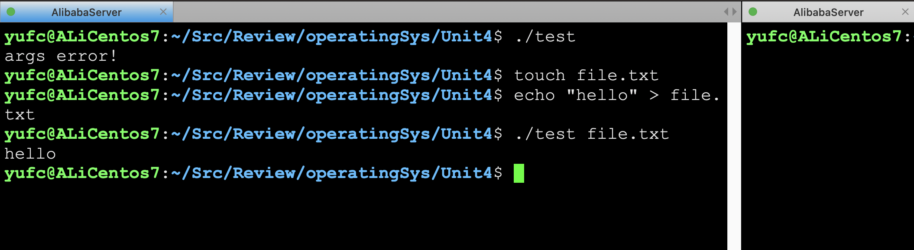
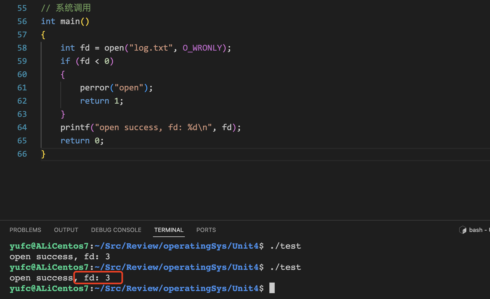
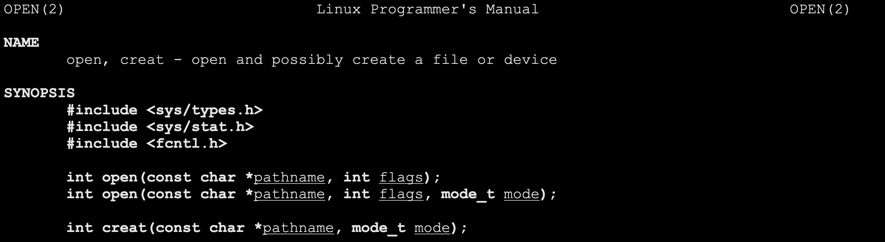
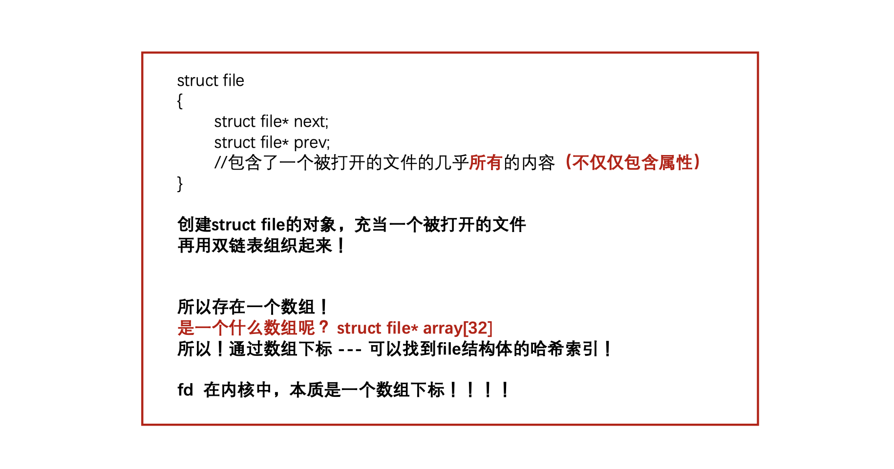
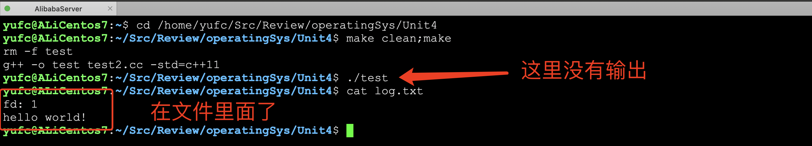
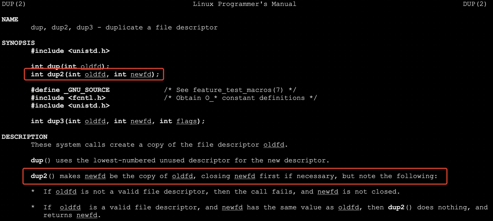
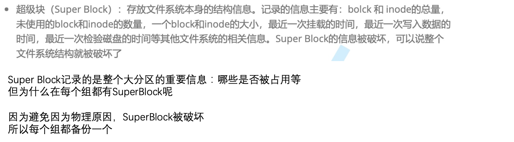

# 基础IO

## 1. 文件描述符预备工作

Linux系统下一切皆文件

### 1.1 复习C文件接口相关细节

```cpp
#include <stdio.h>
#include <stdlib.h>
// 复习C语言文件接口
int main()
{
    FILE *fp = fopen("log.txt", "w");
    if (fp == NULL)
    {
        perror("fopen");
        return 1;
    }
    // 文件操作
    fclose(fp);
    return 0;
}
```

这个文件在哪里创建？

我们实验发现，程序在哪里被执行，`log.txt`就会在哪里被创建，`log.txt`是相对路径。


就是在工作目录下创建。

### 1.2 用C语言相关文件接口模拟实现一个`cat`命令

```cpp
// 模拟实现一个cat命令
int main(int argc, char *argv[])
{
    if (argc != 2)
    {
        printf("args error!\n");
        return 1;
    }
    FILE *fp = fopen(argv[1], "r"); // 打开这个文件
    if (fp == NULL)
    {
        perror("fopen");
        return 2;
    }
    // 读取文件里面的内容
    char line[64];
    while (fgets(line, sizeof(line), fp) != NULL) // 按照行读取
    {
        fprintf(stdout, "%s", line);
    }
    fclose(fp);
    return 0;
}
```



**三个自动打开的文件描述符，很熟悉了，不再赘述。**

### 1.3 学习系统调用



open



**如果打开成功 --- 返回文件描述符，如果打开失败，返回-1。**

**`O_WRONLY`只负责写，如果没有这个文件，是打不开的！**

我们带上`O_CREAT`就能创建了

但是我们发现， 创建出来的这个文件的权限怎么是个奇怪的东西呢？所以，不像我们C接口创建出来的那么整齐

所以，光光创建是不够的！

一般涉及到文件的创建的时候，我们会传递第三个参数，表示权限。


如果这个文件已经有了

我们就使用两个参数的open就行了 不需要三个参数的，带上O_RDONLY选项 --- read only

关闭文件：`fclose`

```cpp
int close(int fd);
```

现在想要往里面写东西了。

用`write`函数！


如果我们往已经有东西的文件里面，再写入一个短一点的字符串。


所以这个是不会帮我们清空文件的。

想要系统帮我们清空还要带上一个选项`O_TRUNC`。

```cpp
int fd = open("test.txt", O_WRONLY | O_CREAT | O_TRUNC, 0666);
```

这样才会帮我们清空。

那如果我想要往文件中追加呢？

把`O_TRUNC`换成`O_APPEND`。

**现在，我们来认识一下 读文件的接口 read**

**read 的返回值我们到进程通信再说 现在我们先不关心**

**read是不会给我们加 \0 的**


### 1.4 文件描述符这个`int`和`FILE*`的关系

`FILE`是一个结构体，是C语言提供的。

C中文件相关库函数内部一定会调用系统调用! 那么在系统角度，认FILE，还是认 fd ? **系统只认fd**

**FILE结构体里面必定封装了fd！**

```cpp
// 文件描述符和FILE*
int main()
{
    printf("stdin: %d\n", stdin->_fileno);
    printf("stdout: %d\n", stdout->_fileno);
    printf("stderr: %d\n", stderr->_fileno);
    return 0;
}
```

```bash
yufc@ALiCentos7:~/Src/Review/operatingSys/Unit4$ ./test
stdin: 0
stdout: 1
stderr: 2
yufc@ALiCentos7:~/Src/Review/operatingSys/Unit4$ 
```

同样！先描述再组织！在内核中，OS内部要为了管理每一个被打开的文件，构建`struct file{}`。



### 1.5 struct file{} 

用双链表组织起来。

```cpp
struct file
{
  	struct file* next;
  	struct file* prev;
  	// 后面的字段 ...
  	// 包含了一个被打开的文件的几乎所有的内容, 不仅仅包含属性
};
```

所以本质是存在一个数组的！

`struct file* array[32]`

所以fd的本质就是一个数组下标。


## 2. 正式开始学习文件描述符

fd的分配规则是，最小的，没有被占用的文件描述符。

然后012是被打开的，这个很熟，所以下一个打开的文件就是3。

### 2.1 输入重定向和输出重定向

如果我把1文件描述符关了，然后打开一个文件，那么这个新打开的文件的fd就是1，这个很好理解。

所以原本要打印到stdout的东西会打印到新打开的文件中去。

```cpp
// 输出重定向
int main()
{
    close(1);
    int fd = open("log.txt", O_WRONLY | O_CREAT | O_TRUNC);
    assert(fd >= 0);
    printf("fd: %d\n", fd);
    printf("hello world!\n");
    fflush(stdout); // 不加这个是没有输出的
    close(fd);
    return 0;
}
```



这里`fflush(stdout)`其实没有刷新屏幕，其实刷新的是`log.txt`，因为里面文件描述符是1，而现在1不是显示器，而是`log.txt`。

> 至于这个代码里面，为什么如果不加`fflush(stdout);`，会没有输出
>
> 因为重定向到文件里面，磁盘文件是全缓冲的（第三节复习缓冲区的时候会讲），所以`printf`之后在缓冲区里面，所以没有输出，然后按道理来说，程序结束会自动刷新，但是你都close了，肯定就刷新不了了。
>
> 所以要不不加close，不用fflush也能有结果
>
> 加了close，那么fflush也要加，不然结果被close清理掉了

输入重定向也是一个道理。


当然，重定向不是这样实现的!我们这种方式仅仅只是利用了文件描述符的特点而已。有没有一种方式，可以让我们的不用关闭别人的，也能完成重定向呢？肯定是有的！

### 2.2 dup2



记住：最终想要输出到哪里，哪里的fd就是第一个参数。

- 如果`oldfd`不是有效的文件描述符，则调用失败，并且`newfd`未关闭
- 如果`oldfd`是有效的文件描述符，而newfd的值与oldfd相同，则`dup2()`不执行任何操作，并且
  返回`newfd`。


**至于为什么，我们上面那种先`close`的重定向方法，最后`close`之后，就不能成功重定向，而左边代码的方法 没问题。
 这其实是dup2的一个特性，涉及到缓冲区的概念。**

### 2.3 如何理解一切皆文件（VFS）


## 3. 缓冲区

缓冲区在哪里？我们写一个代码看看。

这个代码分别调用了C语言的输出函数和系统的输出函数，打印一句话。

```cpp
// 缓冲区
int main()
{
    // C语言
    printf("hello printf\n");
    fprintf(stdout, "hello fprintf\n");
    const char *s = "hello fputs\n";
    fputs(s, stdout);
    // 系统调用
    const char *ss = "hello write\n";
    write(1, ss, strlen(ss)); // 写到fd=1的文件上->stdout
    fork();
    return 0;
}
```


**我们先把现象解释一下:**

**首先**

**write 只打印了一次 其他的打印了两次**

为什么？我们下节课再讲！讲清楚之后，我们可以也可以回答一些尚未解答的现象了！

**为什么会这样，我们现在来解释！**

**关于缓冲区的认识:**

- 一般而言，行缓冲的设备文件 -- 显示器 

- 一般而言，全换从的设备文件 -- 磁盘文件
- 所有设备，永远都倾向于全缓冲！ 缓冲区满了才刷新->需要更少的IO操作->更少次的外设访问->提高效率！

**当和外部设备进行IO的时候，数据量的大小不是主要矛盾， 和外设预备IO的过程才是最耗费时间的**

**其他刷新策略是，结合具体情况做的妥协！**

为什么`fork()`之后拷贝一份？

1. 如果向显示器打印，刷新策略是行刷新，那么最后执行 fork的时候，一定一定是函数执行完了 && 数据已经刷新了

2. 如果对应的程序做了重定向，本质是向磁盘文件打印 --- 隐性的刷新策略变成了全缓冲！此时代码的已经没有意

   义了，所以fork的时候，函数执行完了，但是数据没有刷新！现在数据在，当前进程的C标准库中！

3. 这部分数据，属不属于父进程的数据?肯定是的！fork之后，父子各自执行自己的退出。进程退出是需要刷新缓冲区的！

4. 那么现在的一个问题，刷新这个动作，算不算“写”？算的，从缓冲区刷新出去，相当于写到显示器里

5. 此时会有写时拷贝！

6. 所以！C的接口会出现两份的数据！

## 4. 文件系统和inode

### 4.1 背景知识1


```cc
int main()
{
    // C
    printf("hello printf\n");
    fprintf(stdout, "hello fprintf\n");
    perror("hello perror"); // stderr
    // 系统调用
    const char* s1 = "hello write(stdout)\n";
    const char* s2 = "hello write(stderr)\n";
    write(1, s1, strlen(s1));
    write(2, s2, strlen(s2));
    // C++
    std::cout << "hello cout" << std::endl;
    std::cerr << "hello cerr" << std::endl;
    return 0;
}
```

这个代码直接运行，肯定是这样的。


但是如果重定向一下呢？


1，2都是显示器文件，但是他们 两个是不同的显示器文件! 我们可以认为，同一个显示器文 件，被打开了两次!

一般而言，如果程序运行有可能 有问题的话，建议使用stderr来打 印! 如果是常规打印，建议用stdout 打印。

**然后区分之后，我们可以这么运行，可以把正确的和错误的分开打印到文件里面去。**


可以理解成，把fd为2的放到err.txt里面去。

另外cat还有一个用法：

```bash
cat < log.txt > back.txt
```

这个表示，把log.txt的内容交给cat，cat准备向显示器打印，但是此时再次重定向到back.txt上，所以最终就是，log.txt的内容完成一次拷贝到back.txt上！


### 4.2 背景知识2

> 学习文件系统要掌握的背景知识：
>
> 1. 我们以前学习的都是被打开的文件，那们有没有没有被打开的文件?当然存在，在磁盘里 2. 我们学习磁盘级别的文件，我们侧重点在哪里呢？
>
> 2. 单个文件的角度 --- 这个文件在哪里？这个文件多大?这个文件的其他属性是什么? 站在系统的角度， 一共有多少个文件？各自属性在哪里?如何快速找到？我还可以存储多少 个文件?如何快速找到制定的文件？
>
> 3. 如何进行对磁盘文件进行分门别类的存储，又来支持更好的存取？
>
> **所以，我们先要了解磁盘**

磁盘具体构造，寻址方式，可以看看以前的课件/ppt。

**一个重要概念：虽然磁盘的基本单位是扇区(512字节) 但是操作系统(文件系统)和磁盘进行IO的基本单位是：4kb**

为什么?

1. 太小了，有可能会导致多次的IO，进而导致效率降低
2. 如果OS使用和磁盘一样的大小，万一磁盘基本大小变了的话，OS的源代码要不要改呢? 所以硬件和软件(OS)进行解耦。

### 4.3 文件系统构造





### 4.4 如果文件特别大怎么办

一个block放不下怎么办？

**在data block中，不是所有的datablock只能存文件数据，也可以存其他块的块号！**

我们通过索引找到一个块之后，可以通过这个块继续找到下面的块这样就解决了要存大文件的问题

**找到一个文件的步骤：inode 编号 -> 分区特定的bg -> inode -> 属性 -> 内容**

现在的问题是，inode编号是怎么得到的？

在Linux文件属性中国呢，是没有文件名这个东西的。

> 1. 在一个目录下，可以保存很多文件，但是这些文件名是不能重复的！
> 2. 目录是文件吗？是 -> 所以目录也有自己的inode，也有自己的datablock！

一个文件的文件名，是存在datablock里面存的！

datablock里面存了：文件名和inode编号的映射关系！

**下面我们要回答三个问题：**

1. 创建文件，系统做了什么
2. 删除文件，系统做了什么? 
3. 查看文件，系统做了什么?

为什么删除总比拷贝快很多？因为删除的时候，不用把内容这部分东西真的删掉，只需要把位图标记改了就行了。

所以，删了的东西能恢复吗？肯定是可以的，只是我们不会而已 我们只要找到原来的inode，找到磁盘的位置（删除日志）只要它还没被覆盖就一定能找到。

> **一道面试题:**
>
> 为什么还有空间，但是一直不能创建文件呢？可能就是因为inode申请不下来文件无法创建。
>
> 如果创建出来，也只有个文件名没有inode这个时候一写就会失败，一写就会失败的，无法写入。
