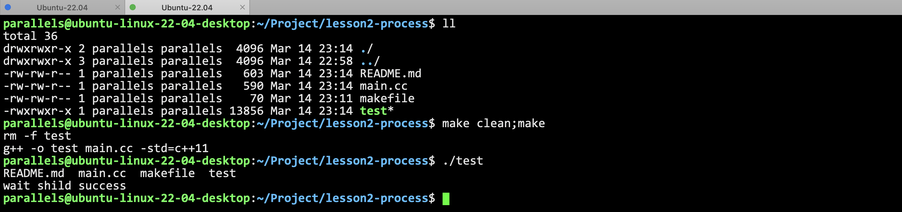
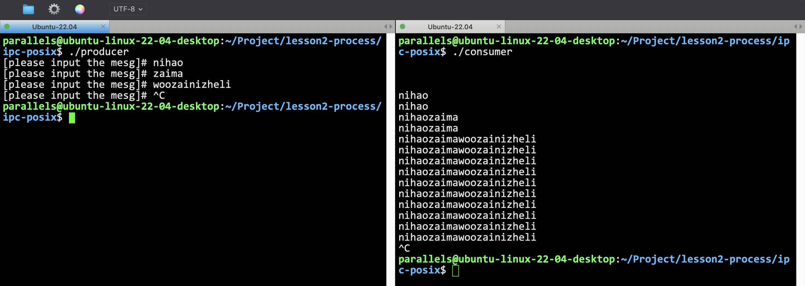

# lesson2-process


## fork的例子

这个例子里面就是fork之后然后调用一下进程替换，相当于写了一个自己的ls命令。

```cpp
void test1()
{
    pid_t pid;
    pid = fork();
    if (pid < 0)
    {
        /* fork error */
        std::cerr << "Fork failed" << std::endl;
        exit(1);
    }
    else if (pid == 0)
    {
        /* child process */
        execlp("/bin/ls", "ls", nullptr);
    }
    else
    {
        /* father process */
        wait(nullptr);
        std::cout << "wait shild success" << std::endl;
    }s
}
```



`execlp`系统调用的最后一个参数传NULL表示参数传递完成了


## 共享内存

共享内存的方式有两种一种是SystemV，另一种就是POSIX。

两者有一定的区别：[Linux 下共享内存方式 ：System V共享内存、共享文件映射(mmap)、POSIX共享内存对比...](https://blog.csdn.net/qq_21438461/article/details/134993098)

### IPC POSIX

生产者：
```cpp

#include <iostream>
#include <stdio.h>
#include <unistd.h>
#include <sys/mman.h>
#include <sys/stat.h>
#include <fcntl.h>
#include <string.h>
#include <string>

const int SIZE = 4096;   // 共享内存的大小
const char *NAME = "OS"; // 共享内存的名字

void make_producer()
{
    int shm_fd = 0;      // 共享内存文件描述符
    void *ptr = nullptr; // 指向共享内存的指针
    // 创建共享内存对象
    shm_fd = shm_open(NAME, O_CREAT | O_RDWR, 0666);
    // 配置这个共享内存的信息
    ftruncate(shm_fd, SIZE);
    // 把共享内存映射到ptr上
    ptr = mmap(0, SIZE, PROT_WRITE, MAP_SHARED, shm_fd, 0);
    // 向共享内存写数据
    while (1)
    {
        std::string mesg;
        std::cout << "[please input the mesg]# ";
        std::cin >> mesg;
        if (mesg == "quit")
            break;
        sprintf((char *)ptr, "%s", mesg.c_str());
        ptr += mesg.size();
    }
    // 最后需要移除shm对象，我认为应该是producer来做这件事的，而不是consumer
    shm_unlink(NAME);
}

int main()
{
    make_producer();
    return 0;
}
```

消费者：
```cpp

#include <iostream>
#include <stdio.h>
#include <unistd.h>
#include <sys/mman.h>
#include <sys/stat.h>
#include <fcntl.h>
#include <string.h>

const int SIZE = 4096;   // 共享内存的大小
const char *NAME = "OS"; // 共享内存的名字

void make_consumer()
{
    int shm_fd = 0;
    void *ptr = nullptr;
    shm_fd = shm_open(NAME, O_RDONLY, 0666);
    while (1)
    {
        ptr = mmap(0, SIZE, PROT_READ, MAP_SHARED, shm_fd, 0);
        std::cout << (char *)ptr << std::endl;
        sleep(1); // 读慢一点
    }
}
int main()
{
    make_consumer();
    return 0;
}
```


对比课件的代码我做了一定修改：

首先，课件里面共享内存删除（unlink）是在consumer上进行的，这是很不合理的。

那么为什么课件选择在consumer上unlink呢，因为如果按照课件这种，只写入一句话的方式来弄。

如果在生产者上unlink，生产者一运行就结束了，消费者还没消费，然后此时的shm已经被删除了，消费者读的ptr就是非法的地址。

如果要把代码改好，就像我这样才行。

而且读取（消费者）要慢一些，因为共享内存的特征：不受控制！如果消费者不sleep一下，producer还没发消息，消费者已经疯狂读读到shm到末尾了，然后就是段错误。

所以我这样设计是最合理的。

但是如果要给共享内存加控制，就需要信号量或者管道的方式了，这些我都是有实现过的，具体看github。



## 管道通信

直接上例子：

```cpp

#include <sys/wait.h>
#include <stdio.h>
#include <stdlib.h>
#include <unistd.h>
#include <string.h>
#include <string>
#include <iostream>

#define READ_END 0
#define WRITE_END 1

void report_and_exit(const char *msg)
{
    perror(msg);
    exit(-1);
}

int main()
{
    int pipe_fd[2]; // 这些我都很熟了
    std::string str = "Nature's first green is gold\n";
    if (pipe(pipe_fd) < 0)
        report_and_exit("call pipe fail");
    pid_t pid = fork();
    if (pid < 0)
        report_and_exit("fork fail");
    if (pid == 0)
    {
        // 子进程
        close(pipe_fd[WRITE_END]); // 关闭写端，子进程只读
        char buffer[1024];
        while (int sz = read(pipe_fd[READ_END], &buffer, 1) > 0)
        {
            buffer[sz] = 0; // 添加一个\0
            std::cout << buffer;
        }
        // 如果while break掉了，说明写端已经关闭了
        close(pipe_fd[READ_END]);
        exit(0); // 课件的 _exit(0) 是系统调用，具体细节我也很熟悉了
    }
    // 父进程
    close(pipe_fd[READ_END]);                           // 父进程只写
    write(pipe_fd[WRITE_END], str.c_str(), str.size()); // 只写了一句话
    close(pipe_fd[WRITE_END]);
    wait(nullptr); // 回收子进程
    return 0;
}
```

