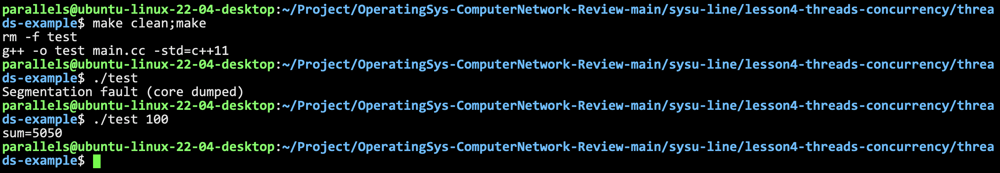
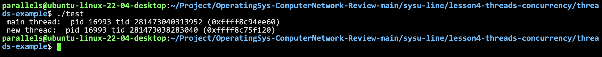
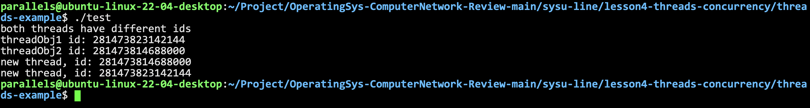
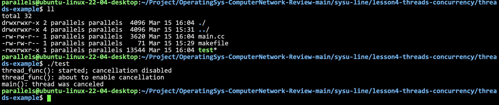

# threads and concurrency

## an easy thread example

```cpp
#include <pthread.h>
#include <stdio.h>
#include <stdlib.h>

int sum = 0; /* share by threads */

void *runner(void *param) /* 线程的callback一定是这种形式的函数 */
{
    int i, upper = atoi((char *)param);
    sum = 0;
    for (i = 1; i <= upper; i++)
        sum += i;
    pthread_exit(0);
}

int main(int argc, char **argv)
{
    pthread_t tid;       // 线程编号
    pthread_attr_t attr; // set of thread attributes
    /* set the default attributes of the thread */
    pthread_attr_init(&attr);
    /* creat the thread */
    pthread_create(&tid, &attr, runner, argv[1]);
    /* wait for the thread to exit */
    pthread_join(tid, nullptr);
    printf("sum=%d\n", sum);
    return 0;
}
```
用一个线程来求和。



## example: show thread/process id

```cpp
pthread_t ntid;

void printids(const char *s)
{
    pid_t pid = getpid();
    pthread_t tid = pthread_self();
    printf(" %s pid %lu tid %lu (0x%lx)\n", s, (unsigned long)pid, (unsigned long)tid, (unsigned long)tid);
}
void *thr_fn(void *args)
{
    printids("new thread: ");
    return ((void *)0);
}
int main()
{
    int err = pthread_create(&ntid, nullptr, thr_fn, nullptr);
    if (err != 0)
        exit(1);
    printids("main thread: ");
    sleep(1);
    return 0;
}
```



## 使用C++11封装的线程库

```cpp
#include <thread>
#include <iostream>
void thr_fn()
{
    std::cout << "new thread, id: " << std::this_thread::get_id() << std::endl;
}
int main()
{
    std::thread threadObj1(thr_fn);
    std::thread threadObj2(thr_fn);
    if (threadObj1.get_id() != threadObj2.get_id())
        std::cout << "both threads have different ids" << std::endl;
    std::cout << "threadObj1 id: " << threadObj1.get_id() << std::endl;
    std::cout << "threadObj2 id: " << threadObj2.get_id() << std::endl;
    threadObj1.join();
    threadObj2.join();
    return 0;
}
```



## Matrix calculation example

一个来自于密歇根大学的，使用多线程进行矩阵运算的例子[EECS 570: Pthreads Tutorial](https://www.eecs.umich.edu/courses/eecs570/discussions/w22/pthreads.html)

## OpenMP

- Set of compiler directives and an API for C, C++, FORTRAN
- Provides support for parallel programming in shared-memory environments
- Identifies parallel regions - blocks of code that can run in parallel
- Not very helpful for complicated thread synchronization, and inapplicable to cluster envirnoments

```cpp
#include <omp.h>
int main()
{
    /* sequential code */
#pragma omp parallel
    {
        printf("I am a parallel region.\n"); // 并行区域
    }
    /* sequential code */
    return 0;
}
```

## thread pools

- **[threadpools project:](../../main-line/Unit9/ThreadPool/)**

## am example of thread cancellation

```cpp
/* am example of thread cancellation */
#include <errno.h>
#define handle_error_en(en, msg) \
    do                           \
    {                            \
        errno = en;              \
        perror(msg);             \
        exit(EXIT_FAILURE);      \
    } while (0)
static void *thread_func(void *ignored_argument)
{
    int s;
    s = pthread_setcancelstate(PTHREAD_CANCEL_DISABLE, nullptr);
    if (s != 0)
        handle_error_en(s, "pthread_setcancelstate");
    printf("thread_func(): started; cancellation disabled\n");
    sleep(5);
    printf("thread_func(): about to enable cancellation\n");
    s = pthread_setcancelstate(PTHREAD_CANCEL_ENABLE, nullptr);
    if (s != 0)
        handle_error_en(s, "pthread_setcancelstate");
    /* sleep() is a cancellation point */
    sleep(1000); /* should get canceled while we sleep */
    return nullptr;
}
int main()
{
    pthread_t thr;
    void *res;
    int s;
    s = pthread_create(&thr, nullptr, &thread_func, nullptr);
    if (s != 0)
        handle_error_en(s, "pthread_create");
    sleep(2); /* Give thread a chance to get started */
    s = pthread_cancel(thr);
    if (s != 0)
        handle_error_en(s, "pthread_cancel");
    s = pthread_join(thr, &res);
    if (s != 0)
        handle_error_en(s, "pthread_join");
    if (res == PTHREAD_CANCELED)
        printf("main(): thread was canceled\n");
    else
        printf("main(): thread wasn't canceled(shouldn't happen!)");
    return 0;
}
```



## tls example on linux

```cpp
__thread int var = 0; // 这样定义的话，每个线程都拥有一份这个变量
void *worker(void *arg)
{
    int idx = (int)arg;
    for (int i = 0; i < 100; ++i)
        printf("thread: %d, ++var=%d\n", idx, ++var);
}
int main()
{
    pthread_t pid1, pid2;
    pthread_create(&pid1, nullptr, worker, (void *)0);
    pthread_create(&pid2, nullptr, worker, (void *)1);
    pthread_join(pid1, nullptr);
    pthread_join(pid2, nullptr);
    return 0;
}
```
如果不采用tls的形式，var最后就不可能是100了，因为现在每个线程都拥有一份var，互不影响，所以两个线程打印的结果都是100。