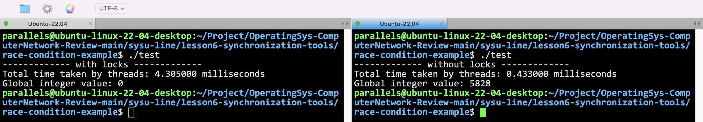

# synchronization-tools

> - Background
> - The Critical-Section Problem
> - Hardware Support for Synchronization
> - Mutex Locks
> - Semaphores
> - Monitors

## race condition example

两个线程同时更改一个全局变量，会出现什么问题？

数据不一致问题，所以需要加锁。可以写一份代码看一下加锁和不加锁的结果有什么区别。

```cpp


#include <stdio.h>
#include <pthread.h>
#include <time.h>

#define NUM_THREADS 2
#define ITERATIONS 10000

#define __if_add_lock false

int global_int = 0;
pthread_mutex_t mutex = PTHREAD_MUTEX_INITIALIZER;

void *increment(void *arg)
{
    for (int i = 0; i < ITERATIONS; i++)
    {
#if __if_add_lock
        pthread_mutex_lock(&mutex); // 要加锁
        global_int++;
        pthread_mutex_unlock(&mutex);
#else
        global_int++;
#endif
    }
    return nullptr;
}
void *decrement(void *arg)
{
    for (int i = 0; i < ITERATIONS; i++)
    {
#if __if_add_lock
        pthread_mutex_lock(&mutex); // 要加锁
        global_int--;
        pthread_mutex_unlock(&mutex);
#else
        global_int--;
#endif
    }
    return nullptr;
}
int main()
{
#if __if_add_lock
    printf("------------- with locks -------------\n");
#else
    printf("------------- without locks -------------\n");
#endif
    pthread_t threads[NUM_THREADS];
    clock_t start_time, end_time;
    // 记录线程创建开始的时间
    start_time = clock();
    // 创建并运行两个线程
    pthread_create(&threads[0], nullptr, increment, nullptr);
    pthread_create(&threads[1], nullptr, decrement, nullptr);
    // 等待线程结束
    pthread_join(threads[0], nullptr);
    pthread_join(threads[1], nullptr);
    // 记录线程结束的时间
    end_time = clock();
    double total_time = (double)(end_time - start_time) * 1000.0 / CLOCKS_PER_SEC;
    // 打印线程任务总共花费的时间
    printf("Total time taken by threads: %lf milliseconds\n", total_time);
    // 打印全局整数的值
    printf("Global integer value: %d\n", global_int);
    return 0;
}
```



所以，不加锁是很有问题的！但同时，并行运行速度肯定比串行要快。

## Xv6 Kernel locks

**Spinlock**
- https://github.com/mit-pdos/xv6-riscv/blob/riscv/kernel/spinlock.h
- https://github.com/mit-pdos/xv6-riscv/blob/riscv/kernel/spinlock.c
- Short-term locks, keep running and waiting, critical section should be short

**Sleeplock**
- https://github.com/mit-pdos/xv6-riscv/blob/riscv/kernel/sleeplock.h
- https://github.com/mit-pdos/xv6-riscv/blob/riscv/kernel/sleeplock.c
- Long-term locks for processes, yield CPU, can wait for a long time
