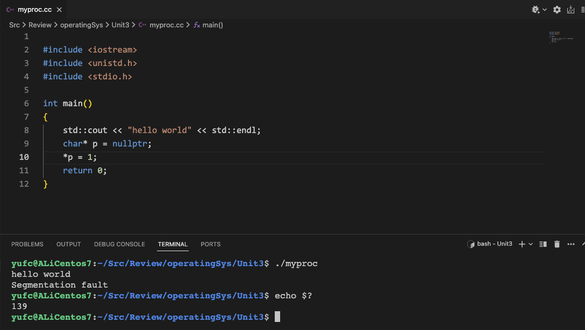
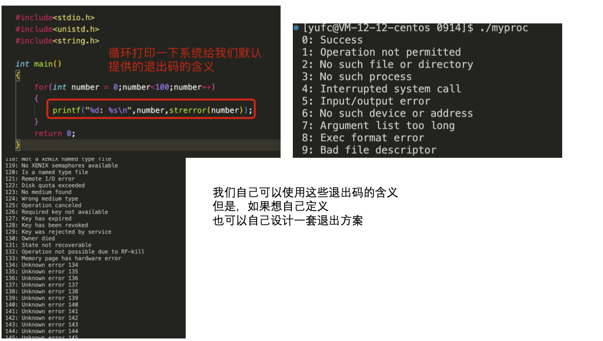
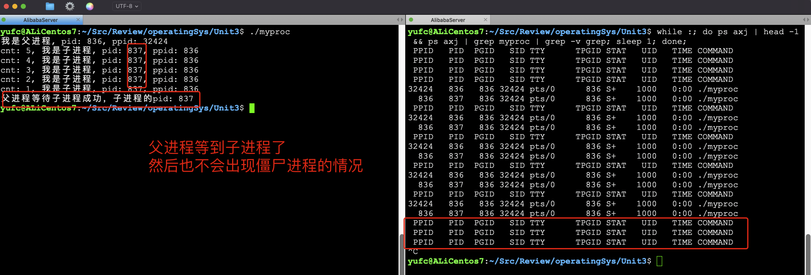
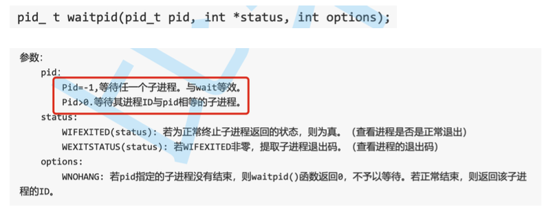
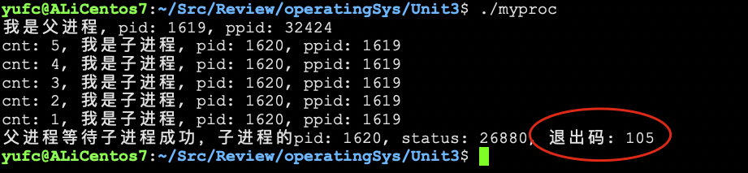
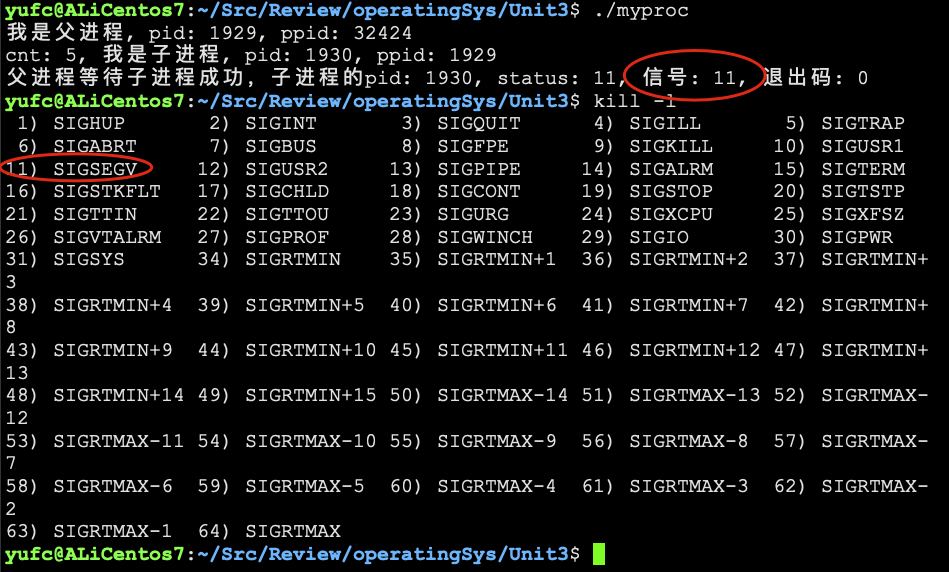
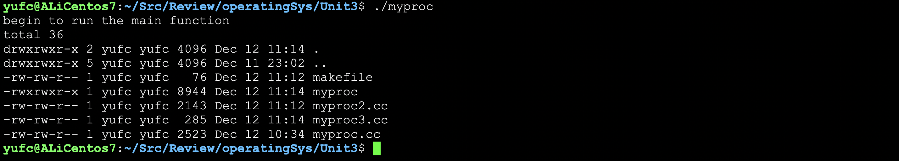
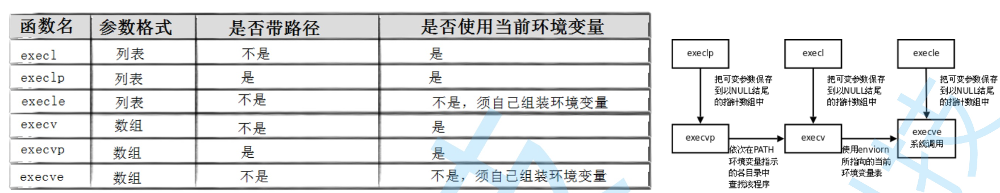

# 进程控制

## 1. 调用fork之后，OS都做了什么？

首先：进程 = 内核数据结构 + 进程代码和数据

进程调用fork。当控制转移到内核中的fork代码后，内核做：

1. 分配新的内存块和内核数据结构给子进程
2. 将父进程部分数据结构内容拷贝到子进程中
3. 将子进程添加到系统进程的列表中
4. fork返回，开始调度器调度

可是一般而言，**子进程时候没有加载的过程的**，因为子进程就是从父进程中来的，不是加载而来的，也就是说，**子进程没有自己的代码和数据！！！**

如何保证独立性？

如果是读：那肯定没问题

如果是写：写时拷贝

**问题：fork之后，是fork之后的代码共享，还是fork之前和fork之后的代码都是共享的？**

## 2. 进程终止

终止之后，操作系统都做了什么？

常见的终止方式？

用代码，如何终止一个进程？

### 2.1 终止之后, 操作系统都做了什么？

释放当时申请的相关内核数据结构的对应代码和数据，本质就是释放系统资源（主要是内存）

### 2.2 进程常见的终止方式？

有三种情况：

1. 代码跑完了，结果正确
2. 代码跑完了，结果错误
3. 代码没有跑完，崩溃了（本质是被OS发送了信号终止）

#### 2.2.1 main() 的返回值

这个返回值不一定是0，它的本质是进程的退出码！

首先我们运行的这个`myproc`的父进程就是bash

我们可以在命令行中，获得最近一次的进程推出码。



所以我们可以通过退出码来判断进程运行不正确的原因。




ls也是一个程序，我们看退出码，是2，对应的就是`No such file or directory`。

### 2.3 用代码终止一个进程

`exit()`函数，这个是C语言提供的。

`_exit()`函数，这个是系统调用。

C语言提供的`exit()` = 刷新缓冲区 + 退出。

系统调用是直接退出的。

```cpp
int main()
{
    std::cout << "hello world";
    sleep(3);
    exit(1);	// 用这个, 字符串是会被打印的, 如果用_exit(1); 字符串是不会被打印的
    return 0;
}
```

但是记得字符串不要加上\n，因为\n有强制刷新的作用。

缓冲区是C语言维护的！

## 3. 进程等待

1. 子进程退出，父进程不管子进程，子进程就要处于僵尸 状态 --- 导致内存泄漏
2. 父进程创建了子进程，是要让子进程办事儿的，那么子 进程把任务完成的怎么样?父进程需要关心吗?如果需 要，如何得知?如果不需要，该怎么处理？

两个函数：`wait()`和`waitpid()`。

```cpp
// wait / waitpid
int main()
{
    pid_t id = fork();
    if (id < 0)
    {
        perror("fork");
        exit(1);
    }
    else if (id == 0)
    {
        // 子进程
        int cnt = 5;
        while(cnt)
        {
            printf("cnt: %d, 我是子进程, pid: %d, ppid: %d\n", cnt, getpid(), getppid());
            sleep(1);
            cnt--;
        }
        exit(0); // 子进程结束
    }
    else
    {
        // 父进程
        while(1)
        {
            printf("我是父进程, pid: %d, ppid: %d\n", getpid(), getppid());
            sleep(1);
        }
    }
    return 0;
}
```

在这个代码里面，就会出现僵尸进程。因为子进程挂了之后没人去回收。


### 3.1 wait

返回值：成功返回被等待的进程pid，失败则返回-1。

参数：输出型参数，获取子进程退出状态，不关心可以设置为NULL。

上面的代码这样改：

```cpp
else
{
// 父进程
    printf("我是父进程, pid: %d, ppid: %d\n", getpid(), getppid());
    pid_t ret = wait(NULL); // 注意，这里是阻塞式等待
    if(ret > 0)
    {
        printf("父进程等待子进程成功，子进程的pid: %d\n", ret);
    }
}
```



### 3.2 waitpid

#### 3.2.1 基本用法

`waitpid(pid, NULL, 0)`等价于`wait(NULL)`。



**那么现在，子进程的完成情况怎么样，我们可以通过 waitpid的第二个参数来得到！**

**此时我们要谈谈status的构成**

**status并不是按照整数来整体使用的！**

**而是按照比特位的方式，对32个比特位进行划分 我们只学习低16位！**


首先啊，我们看这个status，有两种情况一种是正常终止，一种是被信号所杀（程序崩溃）。

#### 3.2.2 正常终止

在正常终止的情况下，低8位全部是是0，然后次低8位是退出码。

可以实验证明。

```cpp
int main()
{
    pid_t id = fork();
    if (id < 0)
    {
        perror("fork");
        exit(1);
    }
    else if (id == 0)
    {
        // 子进程
        int cnt = 5;
        while (cnt)
        {
            printf("cnt: %d, 我是子进程, pid: %d, ppid: %d\n", cnt, getpid(), getppid());
            sleep(1);
            // char *p = nullptr;
            // *p = 1; // 构造一个段错误
            cnt--;
        }
        exit(105); // 子进程结束
    }
    else
    {
        // 父进程
        printf("我是父进程, pid: %d, ppid: %d\n", getpid(), getppid());
        int status = 0;                      // 输出参数
        pid_t ret = waitpid(id, &status, 0); // 注意，这里是阻塞式等待
        if (ret > 0)
        {
            printf("父进程等待子进程成功，子进程的pid: %d, status: %d, 退出码: %d\n", ret, status, (status >> 8) & (0xFF));
        }
    }
    return 0;
}
```

用 status 右移8位，然后取低8位的就行了（异或来取）。

通过这种方法，可以获得子进程的退出码。



#### 3.2.3 被信号所杀

**注意，如果是被信号所杀，那么这个进程是没有正常结束的，那么他的退出码没有任何意义！**

```cpp
else
{
    // 父进程
    printf("我是父进程, pid: %d, ppid: %d\n", getpid(), getppid());
    int status = 0;                      // 输出参数
    pid_t ret = waitpid(id, &status, 0); // 注意，这里是阻塞式等待
    if (ret > 0)
    {
        printf("父进程等待子进程成功，子进程的pid: %d, status: %d, 信号: %d, 退出码: %d\n", ret, status, (status & 0x7F), (status >> 8) & (0xFF));
    }
}
```

通过取前7位，就能获得信号。

然后我们上面子进程弄一个段错误，让os给我们发个信号。



这样我们就验证成功了。

## 4. 解决一些问题


## 5. 继续理解waitpid的参数

第一个参数id：

1. id > 0 表示等待指定进程
2. id == 0 稍后再说
3. id == -1 表示等待任意一个子进程退出，等价于wait()

其实按照上面的方法，如果我们要提取status里面的东西，还需要懂位运算，太麻烦了，其实操作系统给我们提供了宏的。

`WIFEXITED`和`WEXITSTATUS`。

```cpp
else
{
    // 父进程
    printf("我是父进程, pid: %d, ppid: %d\n", getpid(), getppid());
    int status = 0;                      // 输出参数
    pid_t ret = waitpid(id, &status, 0); // 注意，这里是阻塞式等待
    if (WIFEXITED(status)) // WIFEXITED 为真表示正常退出
    {
        printf("子进程执行完毕，子进程的退出码: %d\n", WEXITSTATUS(status));
    }
    else
    {
        printf("子进程异常退出: %d\n", WIFEXITED(status));
    }
}
```

## 6. waitpid的非阻塞等待

现在我们知道，当父进程在等待子进程死的时候，父进程是 阻塞式等待，也就是说，父进程在等待的时候啥都没干，那 么此时，如果我们想让父进程继续去做一些事情呢？ **此时我们需要设置第三个参数， 第三个参数默认为0，表示阻塞等待! WNOHANG表示非阻塞等待。**

**非阻塞等待:**

如果父进程检测子进程的退出状态，发现子进程没有退出，我们的父进程通过 调用waitpid来进行等待。 如果子进程没有退出，我们waitpid这个系统调用立马返回!

那么非阻塞调用的时候，直接就返回了。

那我们怎么知道子进程的状态呢? 我们会每隔一段时间去检测一下子进程的状态，如果监测到子进程结束，就释放子进程 **这个叫做 --- 基于非阻塞调用的轮询检测方案。**

为什么要重点学习阻塞和非阻塞？

因为我们未来编写代码的内容，大部分都是网络代码，大部分都是IO，要不断面临阻塞和非阻塞。

下面是一个小demo

如果以后想让父进程闲的时候去搞一些其他事情，只需要向`Load()`里面去注册就行了。

```cpp
#include <iostream>
#include <vector>
#include <stdio.h>
#include <unistd.h>
#include <sys/types.h>
#include <sys/wait.h>
#include <stdlib.h>
#include <assert.h>

/*
    这里是非阻塞等待线程的一个小demo应用
*/

typedef void (*handler_t)();     // 函数指针类型
std::vector<handler_t> handlers; // 这个数组里面存放函数指针

void fun_one() { std::cout << "task 1 doing ... " << std::endl; }
void fun_two() { std::cout << "task 2 doing ... " << std::endl; }

// 设置对应的回调
void Load()
{
    // 注册
    handlers.push_back(fun_one);
    handlers.push_back(fun_two);
}

int main()
{
    pid_t id = fork();
    assert(id >= 0);
    if (id == 0)
    {
        // 子进程
        int cnt = 5;
        while (cnt--)
        {
            printf("我是子进程, 我的pid: %d, cnt: %d\n", getpid(), cnt);
            sleep(1);
        }
        exit(11); // 仅仅用来测试，如果正常来说是要返回0的。
    }
    else
    {
        int quit = 0;
        while (!quit)
        {
            int status = 0;
            pid_t res = waitpid(-1, &status, WNOHANG); // 非阻塞等待
            if (res > 0)
            {
                // 等待成功，子进程退出了
                printf("等待子进程成功, 退出码: %d\n", WEXITSTATUS(status));
                quit = 1;
            }
            else if (res == 0)
            {
                // 等待成功，但是子进程没有退出！
                printf("子进程还在执行当中，父进程可以等一等，处理一下其他事情\n");
                if (handlers.empty())
                {
                    Load();
                }
                for(auto it : handlers)
                {
                    it(); // 执行已经注册好的事情
                }
            }
            else
            {
                // 等待失败，其实就是waitpid等待失败，比如我们id写错了，没有id这个进程，一般才会出现这个问题
                printf("waitpid失败\n");
                quit = 1;
            }
            sleep(1);
        }
    }
    return 0;
}
```


## 7. 进程替换

进程替换，有没有创建新的进程?

**没有！因为pcb这些结构没变！**

如何理解所谓的将程序放入内存 中?

**本质就是加载!**

有六种`exec`开头的函数。


### 7.1 函数的基本用法

```cpp
int execl(const char* path, const char* arg, ...);
```

可变参数列表。

命令行怎么执行的，就怎么一个一个写上去就行了，**最后一个参数必须是NULL，表示参数传递完毕！**

```cpp
int main()
{
    std::cout << "begin to run the main function" << std::endl;
    execl("/usr/bin/ls", "ls", "-a", "-l", NULL);
    std::cout << "finish to run the main function" << std::endl;
    return 0;
}
```



**最后一句没有被执行，因为替换之后就回不去了！**

### 7.2 这些函数需要返回值吗？

调用失败才会有返回值！

为什么？

因为你调用成功了，你程序都换了，返回值有什么用呢？

而且！

我们也根本不用对返回值做判断，因为如果调用失败了，我们在后面直接`exit(1)`不就好了？

如果调用成功了，这个`exit(1)`也不会呗执行。

**所以我们一般创建子进程去调用这些进程替换，这样也不会影响父进程了。**

```cpp
int main()
{
    pid_t id = fork();
    assert(id >= 0);
    if (id == 0)
    {
        // 子进程
        std::cout << "子进程开始运行 ... " << std::endl;
        execl("/usr/bin/ls", "ls", "-al", NULL);
        exit(1); // 如果调用失败，直接退出
    }
    else
    {
        // 父进程
        std::cout << "父进程开始运行, pid: " << getpid() << std::endl;
        int status = 0;
        pid_t id = waitpid(-1, &status, 0); // 阻塞等待
        if (id > 0)
        {
            std::cout << "wait success, exit code: " << WEXITSTATUS(status) << std::endl;
        }
    }
    return 0;
}
```


### 7.3 看下其他的替换函数


execl其实和execv是一样的。

l的意思就是list所有的参数，就是可变参数嘛。

然后v的意思就是vector，就是把所有的参数放到数组里面才放进去。

execv第二个参数`char *const argv[]`是一个指针数组。

这两个函数除了传参的区别之外，没有任何的区别。

```cpp
char* const argv[] = {"ls", "-al", NULL};
execv("/usr/bin/ls", argv);
```

execlp 的 p 我们可以理解成 我会自己在环境变量PATH中进行查找，你不用告诉我你要执行的程序在哪里?

```cpp
execlp("ls", "ls", "-al", NULL);
```

第三个要稍微说一下。

```cpp
int execle(const char *path, const char *arg,..., char * const envp[]);
int execvpe(const char *file, char *const argv[], char *const envp[]);
```

**我们可以通过execle(execvpe)向替换的程序传递环境变量！**我们就不演示了。

### 7.4 演示：用一个C++程序去调用一个Python程序

```cpp
// 用一个C++去调用一个python
int main()
{
    pid_t id = fork();
    assert(id >= 0);
    if (id == 0)
    {
        // 子进程
        std::cout << "child proc working ..." << std::endl;
        execl("/usr/bin/python", "python", "hello_python.py", NULL);
        std::cout << "called python failed!" << std::endl;
        exit(1);
    }
    else
    {
        // 父进程
        std::cout << "father proc working, pid: " << getpid() << std::endl;
        int status = 0;
        pid_t id = waitpid(-1, &status, 0); // 阻塞等待
        if (id > 0)
        {
            std::cout << "wait success, exit code: " << WEXITSTATUS(status) << std::endl;
        }
    }
    return 0;
}
```

```python
print("hello python! I am a python program!")
```


### 7.5 总结

以上我们学的6个程序替换接口，严格意义上并不是系统调用，而严格意义上的系统调用只有一个，叫做execve。

