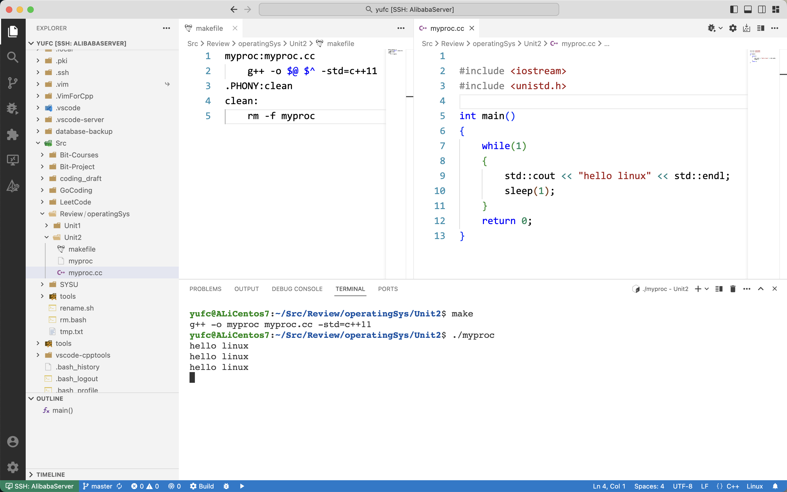
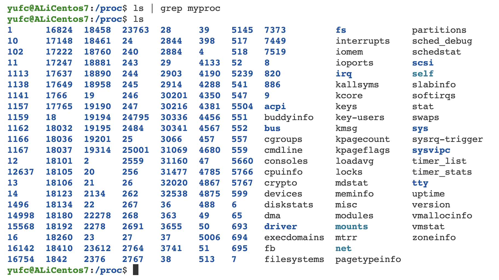
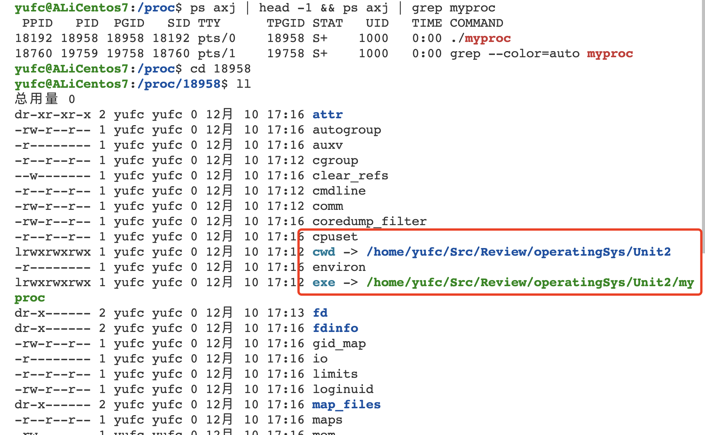
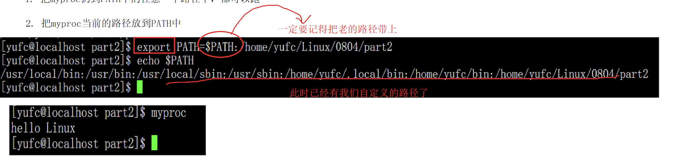
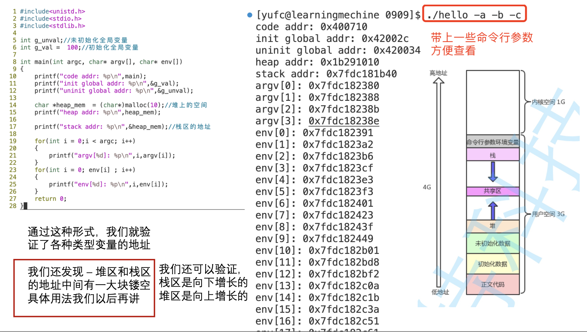
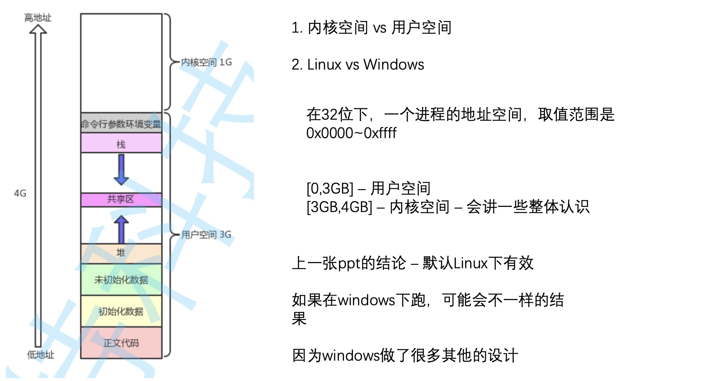
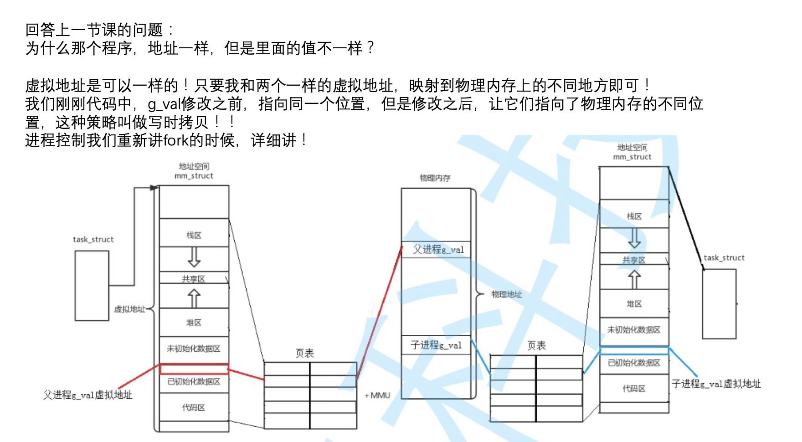
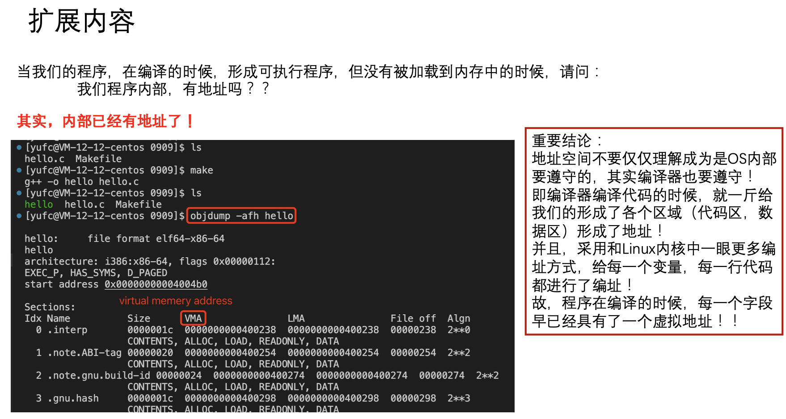

# 进程相关概念

[TOC]

## 1. 基本理念

重要理论：先组织再描述：struct结构体

在操作系统内部，一定存在大量的数据结构和算法

## 2. 进程的描述

### 2.1 为什么需要pcb

为了描述每一个进程，Linux内核会给每一个进程创建一个结构体：PCB

PCB结构体包含了该进程的属性！

```C
struct PCB
{
  	// 属性数据，进程全部的属性数据，如pid
  	// ... 
  	struct PCB* next;
    struct PCB* prev;
};
```

对进程的管理，变成了对进程PCB结构体链表的增删查改！

什么是进程：`进程=对应的代码数据+进程对应的PCB结构体`

### 2.2 什么是pcb

在linux中，叫`task_struct`

里面会有这些内容。


是一个双链表！

## 3. 查看进程




表头也可以带上

```bash
ps axj | head -1 && ps axj | grep myproc
```

**top命令也可以查看进程**

Linux系统下存在一个目录记录进程的信息。

```bash
/proc # 这个目录下都是进程的信息
```



在这个目录下，都是进程的属性。

我们可以看下里面的信息。



事实上，`/proc`目录是动态的，多一个进程就会多一个目录，少一个进程就会少一个目录。

## 4. 在程序中pid

在程序中如何获得pid呢？

```c
getpid() // 这是我们人生中第一个系统调用接口
```

## 5. 父进程是什么

ps axj 一下，发现父进程是bash

bash是shell命令行外壳程序

很熟悉了这些。

## 6. 创建子进程

fork

> fork()
>
> 返回值：
>
> - fork失败，返回-1
> - fork成功：给父进程返回子进程的pid，给子进程返回0
>
> 为什么会有两个返回值呢？不是只能返回一个吗？后面再说。

我们简单写一个代码。


第二个为什么被执行了两次？

因为不加判断，父进程和子进程都会执行。

**复习到后面就会知道，创建子进程的时候，这份代码是被复制了的！**

所以第二句打印语句，父子进程共享。

我们加上一个判断，就能把子进程和父进程分开来！

#### 创建进程的时候，OS要干嘛？

本质，创建一个新的`task_struct`，然后这里里面的字段，有一些是复制父进程的，有一些事自己的。

#### cpu的运行队列 run_queue

进程调度本质上就是调度程序，在run_queue里面挑选一个task_struct来执行！

但是这个运行队列也不是按一般顺序的，这个是调度程序决定的！

## 7. 进程状态

具体可以看博客。

[进程状态｜操作系统｜什么是pcb｜什么是僵尸进程 ｜什么是孤儿进程 【超详细的图文解释】【Linux OS】_pcb结构体-CSDN博客](https://blog.csdn.net/Yu_Cblog/article/details/128597034?ops_request_misc=%7B%22request%5Fid%22%3A%22170220686116800226582348%22%2C%22scm%22%3A%2220140713.130102334.pc%5Fblog.%22%7D&request_id=170220686116800226582348&biz_id=0&utm_medium=distribute.pc_search_result.none-task-blog-2~blog~first_rank_ecpm_v1~rank_v31_ecpm-1-128597034-null-null.nonecase&utm_term=状态&spm=1018.2226.3001.4450)

后台运行一个进程

```bash
./test & 
```

## 8. 状态优先级

状态优先级 = 老的优先级 + nice值

PRI就是优先级，越小越先执行

NI就是nice值


## 9. 环境变量

比较熟了，不再赘述。

要改可以用export

但是要记得把之前的带上



注意，环境变量的组织方式是一个**字符指针数组**！


可以用程序打印所有环境变量。

**第一种获取方式：**


**第二种获取方式：**

略。不常用，其实第一种也不常用，第三种才常用。


**`main`函数的第三个参数，也就是环境变量参数，是从哪里来的？**

一般都是父进程中继承下来的

## 10. 地址空间

### 10.1 什么是地址空间

我们在所有的语言里面提到的地址的概念，本质上都是一个虚拟地址，而不是物理地址。

页表映射，现在只知道大概，不知道细节，所以这一节简单复习一下。


这个结构是可以用代码进行验证的。

```c
// 验证地址空间的栈结构
int g_unval;     // 未初始化的全局变量
int g_val = 100; // 已经初始化的全局变量
int main(int argc, char *argv[], char *env[])
{
    printf("code addr: %p\n", main);              // 代码块位置
    printf("init global addr: %p\n", &g_val);     // 初始化全局变量
    printf("uninit global addr: %p\n", &g_unval); // 未初始化全局变量

    char *heap_memory = (char *)malloc(10);
    printf("heap addr: %p\n", heap_memory); // 堆上的空间

    printf("stack addr: %p\n", &heap_memory); // 栈上的空间

    for (int i = 0; i < argc; i++)
    {
        printf("argv[%d]: %p\n", i, argv[i]);
    }
    for (int i = 0; env[i]; i++)
    {
        printf("env[%d]: %p\n", i, env[i]);
    }
    return 0;
}
```





### 10.2 地址空间是如何设计的

其实就是给各个进程画饼。

先描述后组织！

如果我们可以直接访问物理内存的话，其实是特别不安全的。

所以我们构建了映射机制。

如何理解地址的划分？ --- 其实就是一个简单的`struct`结构体就行了。

```c
struct myroom
{
  	int __start;
  	int __end;
};
```

其实地址空间的各个区域，也是通过这个方式进行划分的。

```c
struct addr_room {
    int code_start; int code_end;
    int init_start; int init_end;
    int uninit_start; int uninit_end;
    int heap_start; int heap_end; 
    //...其他属性
}
```

现在我们又可以知道，`task_struct`里面的又一个字段了！ --- `mm_struct* mm`。

地址空间和页表（用户级）是每一个进程都私有一份的，只要保证，每一个进程的页表，映射的是物理内存的不同区域，我们就能做到，进程之间不会互相干扰进程的独立性。



**回答一个遗留问题：return两个不同的值是怎么回事？**

Return会被执行两次

Return的本质不就是对值进行写入吗? -- 此时发生了**写时拷贝!**

所以两个进程各自其实在物理内存中，有属于自己的变量空间！只不过是在用户层面用同一个变量(虚拟地址!)来标识了!

### 10.3 扩展内容（比较难理解）




### 10.4 为什么要有地址空间的三个理由

#### 10.4.1 理由一

可以有效保护物理内存，禁止非法映射

#### 10.4.2 理由二

因为有地址空间的存在，因为有页表的映射，我们的物理内存中，是不是可以对未来的数据进行任意位置的加载？

当然可以！

**首先，物理内存的分配，可以和进程管理完全解耦！**

所以我们`new`，`malloc`的时候都是申请虚拟地址空间。

**紧接着一个问题：如果我们申请了物理空间，但是又不马上使用，是不是造成了空间的浪费呢？当然是的！**

所以事实上，OS是非常聪明的，你虽然malloc了100个字节，但是我可以一个都不给你！

而你去访问或者使用这100个字节的事哦呼，下面的物理地址空间的相关管理算法才把这个100字节分给你，再让你访问！但是你上层是0感知的！

**这个叫做延迟分配的策略！**

那么，OS是如何知道，一些内存空间虽然在虚拟上给了，但是物理上还 没给呢？这里有个技术叫做 —— 缺页中断!(后面我们再完善这个概念)

#### 10.4.3 理由三

因为物理内存中理论上可以任意位置加载，那么是不是物理内存中的几乎所有的数据和代码在内存是乱序的？

但是，因为页表的存在，它可以进行映射！

那么是不是在进程视角所有的内存分布， 都可以是有序的?

**是的! 地址空间+页表的存在可以将内存的分布有序化!**

> 比如说：
>
> 我一个进程看到的，是一个连续的0-ffff的地址，但是事实上，在物理上，这个可能是分散的，分块的哦！
>
> 但是我进程需要知道这些吗？根本不需要care，我只知道，我用的是0-ffff的连续的地址就行了，底层是怎么样的，我根本不需要知道！

### 10.5 重新理解挂起

