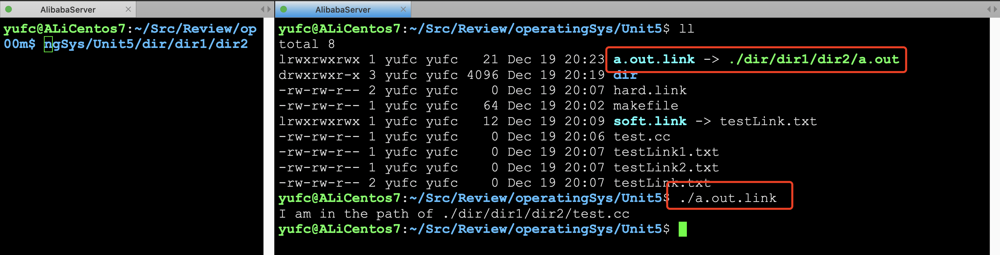
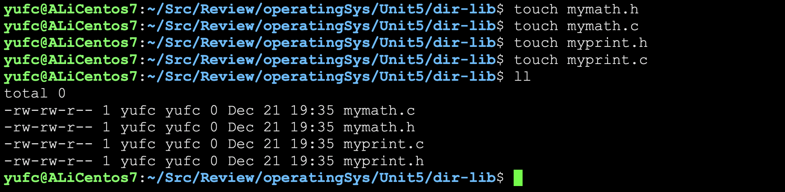
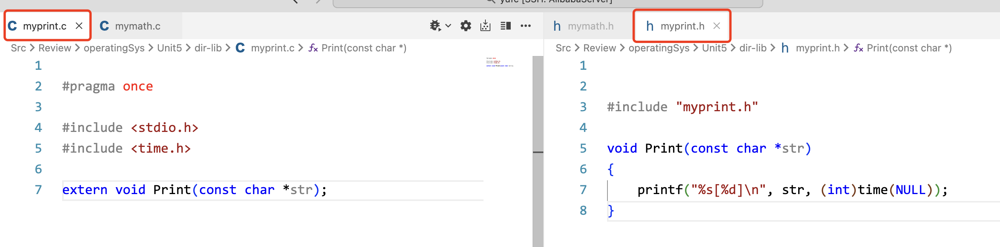
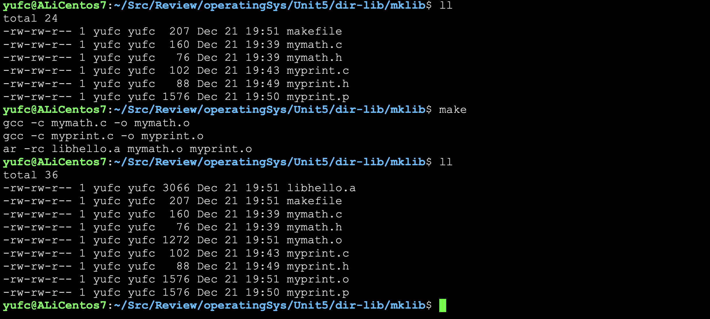
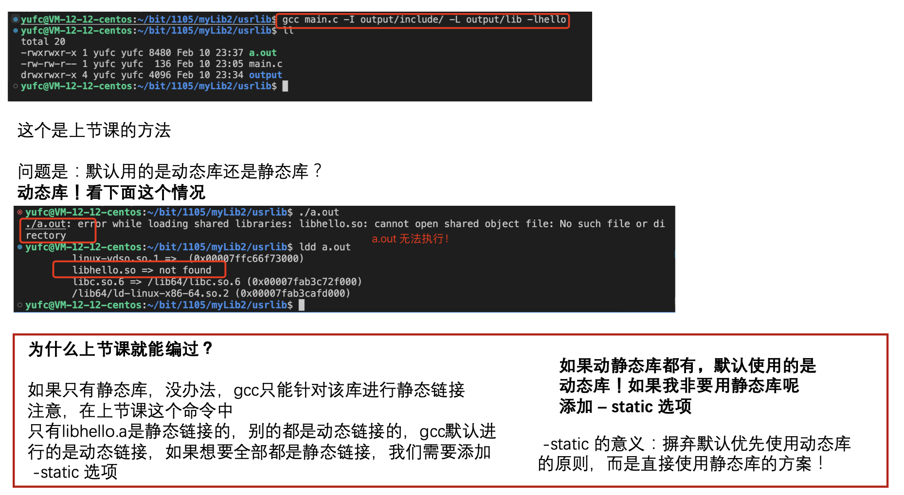
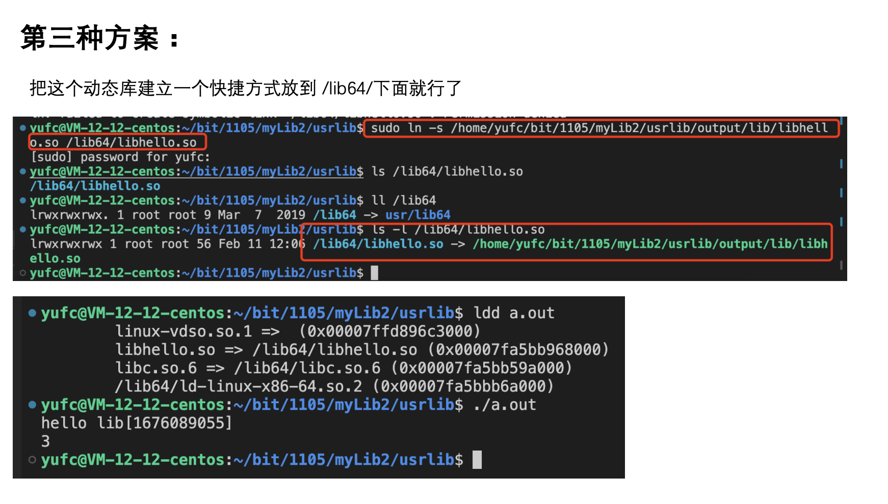

# 复习五·软硬链接和动静态库

## 1. 软硬链接

### 1.1 准备工作


先把这些文件创建好。

### 1.2 命令学习

先创建一个软链接。

```bash
ln -s testLink.txt soft.link
```


然后创建一个硬链接。

```bash
ln testLink.txt hard.link
```


**我们发现，软链接的inode是一个新的inode 硬链接没有新的inode。**

**软硬链接的本质区别：有没有独立的inode 软链接有独立的inode软链接是一个独立的文件硬链接没有独立的inode硬链接不是一个独立的文件。**

**软链接：**

软链接是干嘛的? 回答：**就如同windows下的快捷方式！** 这个解释，应该很清晰了！

此时，如果我们这个可执行程序的路径放到一个很复杂的路径下面我们每次在别的路径如果要执行，就很麻烦所以，我们可以利用软链接的方式！

软链接特性：可以理解成软链接的文件内容，**就是指向文件对应的路径！**



**硬链接：**

创建硬链接，是创建新文件吗？**不是！**

硬链接有inode吗，有inode，创建硬链接究竟做了什么呢？

**就是在制定的目录下，建立了文件名和制定的inode的映射关系，仅此而已！说白了，就是起别名！**


**硬链接和`shared_ptr`是一个道理！**

所以刚才无论是rm hard.link 还是删除testLink.txt 其实都是引用计数 -- 当删到0点时候，才是真正的删除！

**一个问题：为什么创建目录的硬链接数是2？**

因为当前路径的`.`，还有里面目录的`..`都指的是当前目录。

所以怎不用进去么判断一个目录里面有几个目录？**看他的硬链接数 减去 2 就行了！**

## 2. 动静态库

解决两个问题：

1. 如果我想写一个库？
2. 如果我把库给别人，别人是怎么用的呢？

静态库(.a)：程序在编译链接的时候把库的代码链接到可执行文件中。程序运行的时候将不再需要静态库

动态库 (.so)：程序在运行的时候才去链接动态库的代码，多个程序共享使用库的代码。

一个与动态库链接的可执行文件仅仅包含它用到的函数入口地址的一个表，而不是外部函数所在目标文件的整个机器码

在可执行文件开始运行以前，外部函数的机器码由操作系统从磁盘上的该动态库中复制到内存中，这个过程称为动态链接(dynamic linking)

动态库可以在多个程序间共享，所以动态链接使得可执行文件更小，节省了磁盘空间。操作系统采用虚拟内存机制允许物理内存中的一份动态库被要用到该库的所有进程共用，节省了内存和磁盘空间

### 2.1 静态库

**先做好准备工作：**



库里面，要不要main函数呢？肯定是不能有的，因为库是给别人用的。

然后准备一下头文件和.c文件




我们准备在usrlib这个文件夹里 面去用mklib里面的方法。


**如果此时我们只把.h和.o交给别人去用，别人可以用吗？**

**答案是可以的！**

但是，如果.o很多呢？用起来很麻烦怎么办？如果.o丢了一个怎么办？

所以，我们可以把这些.o打包！

这个过程叫做形成静态库（在这种gcc情况下生成的.o完成打包，叫做静态库）

**命令：`ar`**

```bash
ar -rc libhello.a mymath.o myprint.o
```

–rc中的r表示替换，c表示创建 库的名字前缀必须是lib，没有原因

后面跟上要打包的.o

此时这个 .a 就是**静态库！**

**现在我们把这个过程自动化一下，用Makefile实现一下**

```makefile
libhello.a:mymath.o myprint.o
	ar -rc libhello.a mymath.o myprint.o
mymath.o:mymath.c
	gcc -c mymath.c -o mymath.o
myprint.o:myprint.c
	gcc -c myprint.c -o myprint.o
.PHONY:clean
clean:
	rm -f *.o libhello.a
```



在应用的时候，库一般是怎么给别人的呢？

**这些规范和习惯一定要注意！**

**现在要将一个名字为hello的库给别人**

- **hello里面要有两个文件夹**

- **第一个叫做include 里面包含了所有的头文件 第二个叫做lib里面包含了所有的库文件**

我们可以通过makefile去搞定这些事情

```makefile
libhello.a:mymath.o myprint.o
	ar -rc libhello.a mymath.o myprint.o
mymath.o:mymath.c
	gcc -c mymath.c -o mymath.o
myprint.o:myprint.c
	gcc -c myprint.c -o myprint.o

.PHONY:hello
hello:
	mkdir -p hello/lib
	mkdir -p hello/include
	cp -rf *.h hello/include
	cp -rf *.a hello/lib

.PHONY:clean
clean:
	rm -f *.o libhello.a
	rm -rf hello
```


**现在我们把这个库交给usrlib里面去用**

我们讲三种方法：

第一种：放到gcc的默认搜索路径下去：

- 头文件 `/usr/include`
- 库 `/lib64` 或 `/usr/lib64`

我们把我们hello的include拷贝到默认的头文件搜索路径下 把hello的lib拷贝到默认的库路径下。

**拷贝过去这个动作叫做库的安装！**

拷贝过去之后，直接编译还是不行的。

因为我们这些库都是第三方库，C语言自己的静态库会自己去链接，但是第三方库不会，所以我们gcc的时候要自己加选项去链接。

```bash
gcc main.c -lhello
```

**选项怎么写：`-l`加上`libhello.a`这个东西东西去掉前缀`lib`，去掉后缀`.o`，这个是规定！**

不建议用这种方法，因为我们自己写的库是没有进行过可靠性测试的也就是没经过测试的。

直接安装可能会污染别人的头文件和库 所以我们赶紧把刚刚拷贝进去的rm掉，这个过程叫做**卸载**。

**然后第二种方法就是显式的调用了。**

```bash
gcc main.c -I ./hello/include -L ./hello/lib -lhello
```

`-lhello`这个选项很容易漏，记得不要漏掉！

### 2.2 动态库

静态库，是会把代码拷贝进可执行程序的(在链接的时候)。

而动态库，而是让我们自己的程序和动态库和程序产生关联。

```makefile
libhello.so:mymath_d.o myprint_d.o
	gcc -shared myprint_d.o mymath_d.o -o libhello.so
mymath.o:mymath.c
	gcc -fPIC -c mymath.c -o mymath_d.o
myprint.o:myprint.c
	gcc -fPIC -c myprint.c -o myprint_d.o
```

**`-fPIC`表示生成一个和位置无关的二进制库**

**与位置无关表示：可以在任何地址在被加载**

同时生成静态库和动态库。

```makefile
.PHONY:all
all:libhello.so libhello.a

libhello.so:mymath_d.o myprint_d.o
	gcc -shared myprint_d.o mymath_d.o -o libhello.so
mymath_d.o:mymath.c
	gcc -fPIC -c mymath.c -o mymath_d.o
myprint_d.o:myprint.c
	gcc -fPIC -c myprint.c -o myprint_d.o

libhello.a:mymath.o myprint.o
	ar -rc libhello.a mymath.o myprint.o
mymath.o:mymath.c
	gcc -c mymath.c -o mymath.o
myprint.o:myprint.c
	gcc -c myprint.c -o myprint.o

.PHONY:hello
hello:
	mkdir -p hello/lib
	mkdir -p hello/include
	cp -rf *.h hello/include
	cp -rf *.a hello/lib
	cp -rf *.so hello/lib

.PHONY:clean
clean:
	rm -f *.o libhello.a libhello.so
	rm -rf hello
```


怎么用？



**浅谈动态库的加载**


**怎么用动态库？**


丢到这个环境变量里面去。

```bash
echo $LD_LIBRARY_PATH
```




## 3. 为什么要有库？

1. 站在使用库的角度，库的存在，可以大大减少我们开发的周期，提高软件本身的质量
2. 站写写库的人的角度
   1. 简单
   2. 代码安全
