# 复习八·线程

## 1. 如何理解线程

只要满足，比进程轻量化，cpu内所有线程资源共享，创建维护成 本更低等要求，就能叫线程。

**不同的OS实现方式不同，下面这个是Linux特有的方案。Linux没有给线程重新设计数据结构！**

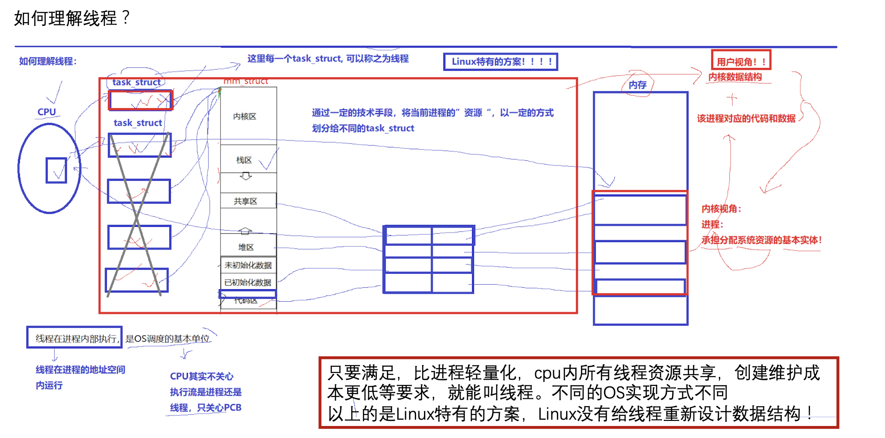

什么叫做进程？

`pcb + 地址空间 + 页表`

**CPU调度的基本单位：线程！**

## 2. 开始使用pthread线程库

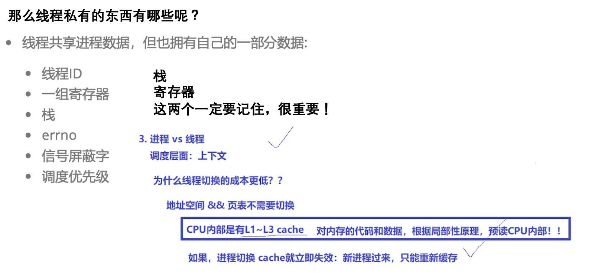


```cpp
void *threadRun(void *args)
{
    const std::string name = (char *)args;
    while(true)
    {
        std::cout << name << ", pid: " << getpid() << std::endl;
        // 线程在进程内部运行，所以getpid()的结果应该是对应父进程的pid
        sleep(1);
    }
}
int main()
{
    pthread_t tid[5];
    char name[64];
    for (int i = 0; i < 5; i++)
    {
        snprintf(name, sizeof(name), "%s-%d", "thread", i); // 线程的编号
        pthread_create(tid + i, nullptr, threadRun, (void *)name);
        sleep(1);
    }
    while (true)
    {
        std::cout << "main thread, pid: " << getpid() << std::endl;
        sleep(3);
    }
    return 0;
}
```


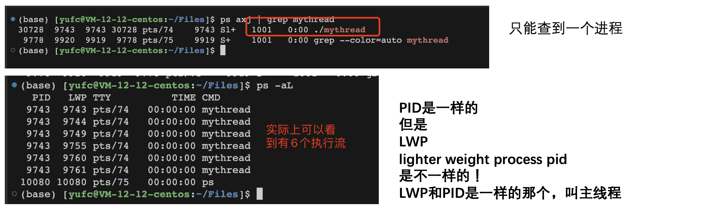

## 3. 线程的缺点

**性能损失**

一个很少被外部事件阻塞的计算密集型线程往往无法与共它线程共享同一个处理器。如果计算密集型线程的数量比可用的处理器多，那么可能会有较大的性能损失，这里的性能损失指的是增加了额外的同步和调度开销，而可用的资源不变。

**健壮性降低**

编写多线程需要更全面更深入的考虑，在一个多线程程序里，因时间分配上的细微偏差或者因共享了。
不该共享的变量而造成不良影响的可能性是很大的，换句话说线程之间是缺乏保护的。

**缺乏访问控制**

进程是访问控制的基本粒度，在一个线程中调用某些OS函数会对整个进程造成影响。

**编程难度提高**

编写与调试一个多线程程序比单线程程序困难得多。

## 4. 线程也是需要等待的

### 4.1 pthread_join

1. 线程谁先运行与调度器相关。
2. 线程一旦异常，都可能导致整个进程整体退出。
3. 线程在创建并执行的时候，线程也是需要等待的，如果只进程不等待，会引起类似于进程的僵尸问题，导致内存泄漏。

```cpp
/* 线程等待 */
void *threadRoutine(void *args)
{
    // 要传递给线程的东西，可以用void* 的形式在pthread_create的第四个参数里面传递过来
    int i = 0;
    while (true)
    {
        std::cout << "new thread: " << (char *)args << " running ..." << std::endl;
        sleep(1);
        if (i++ == 5)
            break; // 当i加到5的时候break
    }
    // 如果我想给主线程返回一个东西呢，要用void*的形式返回
    return (void *)10;
}
int main()
{
    pthread_t tid;
    pthread_create(&tid, nullptr, threadRoutine, (void *)"thread 1");
    void *ret = nullptr;     // 线程给我返回的结果
    pthread_join(tid, &ret); // 默认会阻塞等待
    std::cout << "main thread wait done, main quit." << std::endl;
    printf("%d\n", ret);
    return 0;
}
```

可以用`(void*)`的形式给主线程返回东西。

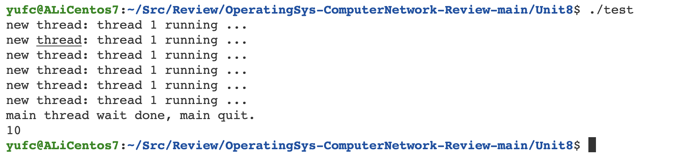

**注意：线程里面不能直接用`exit()`，不然整个进程都退出了！**

### 4.2 pthread_exit

除了return之外这个函数也可以用来终止线程返回一个数给主线程。


```cpp
void *threadRoutine(void *args)
{
    // 要传递给线程的东西，可以用void* 的形式在pthread_create的第四个参数里面传递过来
    int i = 0;
    while (true)
    {
        std::cout << "new thread: " << (char *)args << " running ..." << std::endl;
        sleep(1);
        if (i++ == 5)
            break; //
        pthread_exit((void *)13);
    }
    // 如果我想给主线程返回一个东西呢，要用void*的形式返回
    return (void *)10;
}
```

这样后面这个10就没有被返回去了，返回的是13。


### 4.3 pthread_cancel

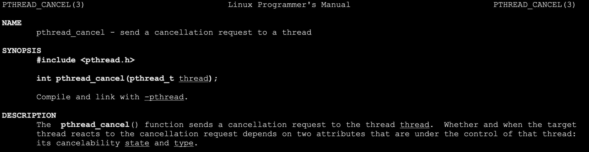

**线程一直不退出，主线程cancel新线程**

```cpp
/* 线程等待 */
void *threadRoutine(void *args)
{
    // 要传递给线程的东西，可以用void* 的形式在pthread_create的第四个参数里面传递过来
    int i = 0;
    while (true)
    {
        std::cout << "new thread: " << (char *)args << " running ..." << std::endl;
        sleep(1);
        // if (i++ == 5)
        //     break; //
        // pthread_exit((void *)13);
    }
    // 如果我想给主线程返回一个东西呢，要用void*的形式返回
    return (void *)10;
}
int main()
{
    pthread_t tid;
    pthread_create(&tid, nullptr, threadRoutine, (void *)"thread 1");
    void *ret = nullptr;     // 线程给我返回的结果
    pthread_cancel(tid);     // cancel 这个线程
    pthread_join(tid, &ret); // 默认会阻塞等待
    std::cout << "main thread wait done, main quit." << std::endl;
    printf("%d\n", ret);
    return 0;
}
```

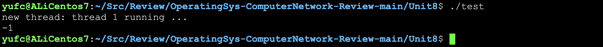

## 5. 线程id是什么

**pthread_t 本质是一个地址！**

## 6. 全局变量被所有线程共享

```cpp
/* 全局变量被所有线程共享 */
int g_val = 0;
void *threadRoutine(void *args)
{
    while (1)
    {
        std::cout << (char *)args << ", "
                  << " &g_val: " << &g_val << ", g_val: " << g_val << std::endl;
        g_val++;
        sleep(1);
    }
}
int main()
{
    pthread_t tid;
    pthread_create(&tid, nullptr, threadRoutine, (void *)"thread_1");
    printf("%lu, %p\n", tid, tid);
    while (true)
    {
        std::cout << "main thread: "
                  << " &g_val: " << &g_val << ", g_val: " << g_val << std::endl;
        // 我们发现新线程对g_val的改动，主线程可以看到
        sleep(1);
    }
    return 0;
}
```

**这样我们可以看到：新线程对g_val的改动，主线程可以同步。**

我们也可以设置，让线程自己占有一个全局变量！

```cc
__thread int g_val = 0;
```

这个`g_val`就是每个线程自己都有的。

## 7. 在新线程里面进行程序替换会怎么样？

1. 先把所有除了主线程之外的其他线程终止
2. 然后替换主线程（主进程）

## 8. 分离线程

下面这个场景：

如果我创建了一个线程，但是我创建完就不想管了，我也不想阻塞等待。我觉得这个线程是一个负担，怎么办？

在学习进程的时候这个处理方法是：非阻塞等待/SIGCHLD信号忽略掉的方式 但是线程等待是不能非阻塞的，所以只能是下面这个方法。


## 9. 线程互斥

### 9.1 互斥锁的基本使用

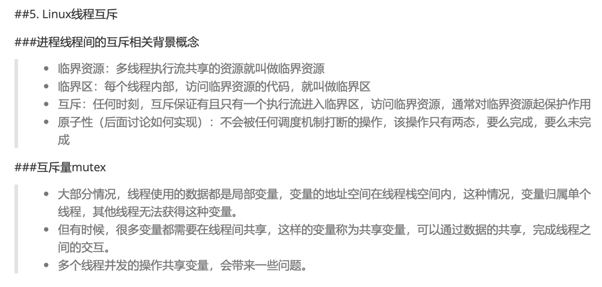

```cpp
// 临界资源问题
// 如果多个线程同时访问同一个全局变量，并对他进行数据计算，会出问题吗
// 抢票
int tickets = 10000;
void *getTickets(void *args)
{
    (void)args;
    while (true)
    {
        if (tickets > 0)
        {
            usleep(1000);
            printf("%p: %d\n", pthread_self(), tickets);
            tickets--;
        }
        else
            break; // 没有票了
    }
}
int main()
{
    pthread_t t1, t2, t3;
    // 多线程抢票的逻辑
    pthread_create(&t1, nullptr, getTickets, nullptr);
    pthread_create(&t2, nullptr, getTickets, nullptr);
    pthread_create(&t3, nullptr, getTickets, nullptr);
    pthread_join(t1, nullptr);
    pthread_join(t2, nullptr);
    pthread_join(t3, nullptr);
    return 0;
}
```

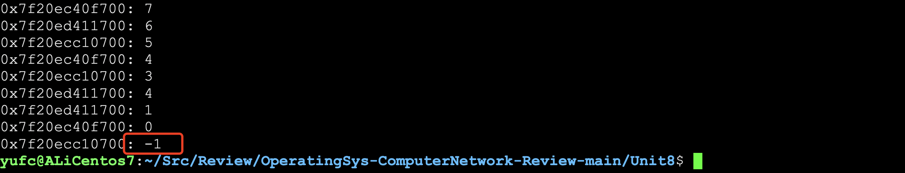

出问题了。

这是因为`tickets`是临街资源，需要用锁保护！

**我们最常用的: `pthread_mutex_init` 互斥锁**

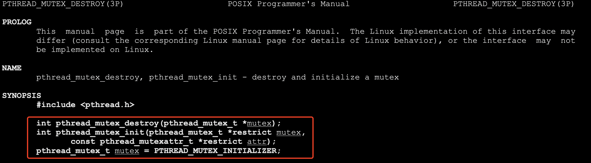

对互斥锁的初始化有两种方法，第一种是调用初始化接口，第二种是直接把一个宏赋值给锁如上图所示。

```cc
// 临界资源问题
// 如果多个线程同时访问同一个全局变量，并对他进行数据计算，会出问题吗
// 抢票
int tickets = 10000;
pthread_mutex_t mtx = PTHREAD_MUTEX_INITIALIZER;
void *getTickets(void *args)
{
    (void)args;
    while (true)
    {
        pthread_mutex_lock(&mtx);
        if (tickets > 0)
        {
            usleep(1000);
            printf("%p: %d\n", pthread_self(), tickets);
            tickets--;
            pthread_mutex_unlock(&mtx);
        }
        else
        {
            pthread_mutex_unlock(&mtx);
            break; // 没有票了
        }
        return nullptr;
    }
}
```

为什么加锁不加在while前面解锁放在while结束之后？

如果是这样，整个抢票的逻辑就完全串行了，这和没有多线程有什么区别？

所以我们加锁的时候，一定要保证加锁的粒度，越小越好！

如果锁定义在全局区域

就可以这样用宏定义

如果是定义锁为局部变量 就要用`init`接口定义。

加了锁之后，线程在临界区中，是否会切换，会有问题吗?原子性的体现

加了锁之后，线程在临界区中，是否会切换?会切换，会有问题吗？不会！

虽然被切换，但是我们是持有锁被切换的！

其他执行流想要执行这部分代码，要申请锁，因此其他执行流申请锁会失败！

加锁就是串行执行了吗?

是的！执行临界区代码一定是串行的

要访问临界资源，每一个线程都必须申请锁 前提是，每一个线程都必须先看到同一把锁 && 去访问它 那么，锁本身是不是一种共享临界资源? 谁来保证锁的安全呢？**所以为了保证锁的安全，申请和释放锁必须是原子的！！**

如何保证?锁究竟是什么？锁是如何实现的？

### 9.2 锁是如何实现的？


### 9.3 死锁


## 10. 线程同步

### 10.1 引入

**引入同步:**

**主要是为了解决访问临界资源和理性的问题。即：按照一定的顺序，进行临界资源的访问，这个叫做线程同步！**

**方案1：条件变量**

当我们申请临界资源前：先要做临界资源是否存在的检测，要做检测的本质：也是访问临界资源!因此，对临界资源的检测，也一定是需要在加锁和解锁之间的！


### 10.2 相关接口


这些就是线程同步和唤醒的相关接口

**现在要写一个代码：主线程能按照要求一次唤醒1，2，3，4的线程 主线程让你执行你就执行，不让你执行你就不要执行我们要完成以上这种效果!**

```cc


#include <iostream>
#include <pthread.h>
#include <string>
#include <unistd.h>

#define TNUM 4 // 线程的数量

typedef void (*func_t)(const std::string &name, pthread_mutex_t *pmtx, pthread_cond_t *pcond);
volatile bool quit = false;

class ThreadData
{
public:
    std::string __name;
    func_t __func;
    pthread_mutex_t *__pmtx;
    pthread_cond_t *__pcond;

public:
    ThreadData(const std::string &name, func_t func, pthread_mutex_t *pmtx, pthread_cond_t *pcond)
        : __name(name), __func(func), __pmtx(pmtx), __pcond(pcond) {}
};

// 线程要执行的函数
void func1(const std::string &name, pthread_mutex_t *pmtx, pthread_cond_t *pcond)
{
    while (!quit) // 当 quit==true 的时候，所有线程退出
    {
        // wait一定是在加锁和解锁之间的
        pthread_mutex_lock(pmtx);
        // 这里要做的一件事其实就是:
        // if(临界资源就绪吗？不就绪)
        //   刚开始学的做法是：break，然后重新检测
        //   但是现在我不想让线程一直检测了，那么就让它去等！等到就绪为止
        // 所以！其实我们访问了临界资源！
        pthread_cond_wait(pcond, pmtx); // 默认该线程再执行的的时候，wait被执行，线程阻塞
        std::cout << name << " A_running..." << std::endl;
        pthread_mutex_unlock(pmtx);
    }
}
void func2(const std::string &name, pthread_mutex_t *pmtx, pthread_cond_t *pcond)
{
    while (!quit) // 当 quit==true 的时候，所有线程退出
    {
        pthread_mutex_lock(pmtx);
        pthread_cond_wait(pcond, pmtx);
        std::cout << name << " B_running..." << std::endl;
        pthread_mutex_unlock(pmtx);
    }
}
void func3(const std::string &name, pthread_mutex_t *pmtx, pthread_cond_t *pcond)
{
    while (!quit) // 当 quit==true 的时候，所有线程退出
    {
        pthread_mutex_lock(pmtx);
        pthread_cond_wait(pcond, pmtx);
        std::cout << name << " C_running..." << std::endl;
        pthread_mutex_unlock(pmtx);
    }
}
void func4(const std::string &name, pthread_mutex_t *pmtx, pthread_cond_t *pcond)
{
    while (!quit) // 当 quit==true 的时候，所有线程退出
    {
        pthread_mutex_lock(pmtx);
        pthread_cond_wait(pcond, pmtx);
        std::cout << name << " D_running..." << std::endl;
        pthread_mutex_unlock(pmtx);
    }
}

// 每个线程被调用，就会调用Entry函数，然后Entry会构建ThreadData对象去执行ThreadData里面的方法
void *Entry(void *args)
{
    // args是传过来的，是ThreadData类型
    ThreadData *td = (ThreadData *)args;             // td再每一个线程自己私有的栈空间中保存
    td->__func(td->__name, td->__pmtx, td->__pcond); // 它是一个函数，调用完成就要返回！
    delete td;
    return nullptr;
}

int main()
{
    /*
        我们构建好多线程运行架构之后
        我们要开始控制这些线程了！
        先定义互斥锁和条件变量
    */
    pthread_mutex_t mtx;
    pthread_cond_t cond;
    // 初始化条件变量和互斥锁
    pthread_mutex_init(&mtx, nullptr);
    pthread_cond_init(&cond, nullptr);
    pthread_t tids[TNUM];

    // 让不同的线程做不同的工作
    func_t func_list[TNUM] = {func1, func2, func3, func4};
    for (int i = 0; i < TNUM; i++)
    {
        // 让不同的线程做不同的工作
        std::string name = "Thread: ";
        name += std::to_string(i + 1);
        ThreadData *td = new ThreadData(name, func_list[i], &mtx, &cond);
        pthread_create(tids + i, nullptr, Entry, (void *)td);
    }
    std::cout << "new threads generate success" << std::endl;
    std::cout << "main thread begin to control all the new threads ... " << std::endl;
    // 控制对应的线程按照一定规则执行

    int cnt = 10;
    while (cnt--)
    {
        pthread_cond_signal(&cond);
        sleep(1);
    }
    std::cout << "thread ctrl done!" << std::endl;
    quit = true;
    // 因为改成true之后，线程的循环就进不去了，所有线程可能都在等着
    // 所以这里再唤醒最后一次，让线程退出
    pthread_cond_broadcast(&cond);
    // 当cnt倒数完成之后，我们就能看到join的信息了
    for (int i = 0; i < TNUM; i++)
    {
        pthread_join(tids[i], nullptr);
        std::cout << "thread: " << tids[i] << " quit" << std::endl;
    }
    pthread_mutex_destroy(&mtx);
    pthread_cond_destroy(&cond);
    return 0;
}
```

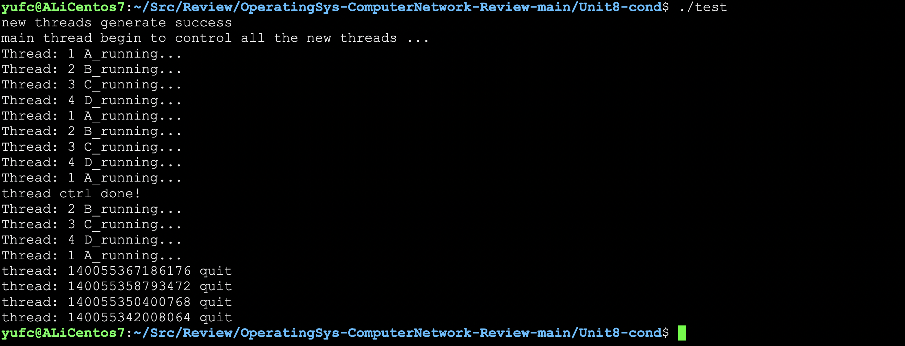


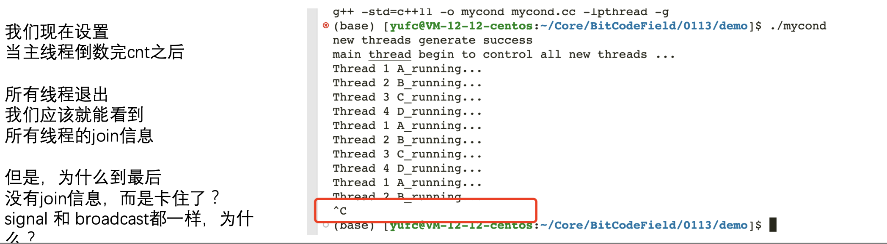

